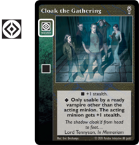
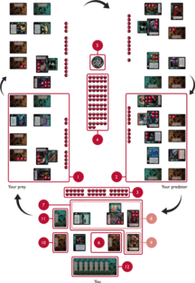
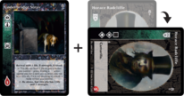
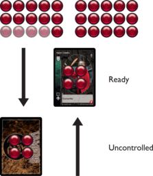

# [**1. Introduction**](https://www.vekn.net/rulebook/1-introduction)

*Vampire: The Eternal Struggle is a customisable card game in which four
or five players take on the roles of ancient vampires known as
Methuselahs. The game is set in a shadowy, alternate reflection of our
own reality called the World of Darkness. Methuselahs are considered to
be mere legend by younger vampires. Younger vampires think that they
pursue their own ends, even as they are being used by one Methuselah to
undercut the influence of another. Throughout the world, Methuselahs
manipulate their minions to frustrate the designs of the other
Methuselahs, just as they have for as long as anyone can remember. These
eternal struggles are sometimes covert and subtle, sometimes open and
spectacular.*

This set of rules includes all the rules needed to play Vampire: The Eternal Struggle.
To make it easier to learn the rules, some of them appear in "Advanced rules" sections. Although they are an integral part of the game, we recommend new players to skip them whilst they learn the basic game.

## **Object of the Game**

Your goal is to accumulate the most victory points by destroying the
influence held by rival Methuselahs. You accomplish this goal by using
your influence to gain control of younger vampires and using those to
perform actions to reduce the influence of rival Methuselahs. Influence
is represented by pool counters, the main currency of the game. If a
Methuselah runs out of pool, they are ousted from the game. As
Methuselahs are ousted, other Methuselahs will earn victory points; the
winner is the Methuselah with the most victory points at the end of the
game.

**Cards:** Each Methuselah's deck has two components: a crypt and a
library.

The cards in your crypt represent the vampires you hope to control; they
have oval portraits on the front and amber marble backs.

The cards in your library represent the wider World of Darkness and
allow you or your minions to operate in that world; they have square
illustrations on the front and green marble backs.

The crypt and library form two independent stacks from which crypt cards and library cards 
are drawn during the game (see Game Setup, Drawing cards and Influence Phase). Library cards drawn
are moved to their owner's hand. Crypt cards drawn are moved to their owner's uncontrolled region (see Play Area).

**Counters:** Counters are an integral part of the game. Each Methuselah
needs about 40 counters: 30 for their starting pool and extra counters,
to represent the blood bank. The counters used to represent pool, blood
or life are the same but are named differently when they are in your
pool, on vampires (blood) or on allies (life). For instance, if you move
a counter from your pool to a vampire, it becomes a blood. Similarly, a
blood stolen from a vampire by an ally becomes a life. When you burn,
pay, or spend 1 blood or pool counter, you return it to the blood bank.
If you would gain 1 blood or pool counter you gain it from the blood
bank. When blood is added to a vampire, it is added from the blood bank.
Blood and pool counters can be any convenient items, such as coins,
glass beads, or stones. Single-item methods of keeping track of changing
numbers (for example, dice) are discouraged, due to the frequent need to
move counters from one place to another.

**The Edge:** The Edge is a symbol showing that your minions have
temporarily given you an advantage over the other Methuselahs. Choose an
object to represent the Edge. Any small, distinctive object, such as a
figurine, trinket or a glove will do.

# [**2. Card Types**](https://www.vekn.net/rulebook/2-card-types)

## **CRYPT CARDS**

Each crypt card has a set of elements that define the vampire as described below.

**Name:** Each crypt card is unique, so only one copy of each can be in 
play at a time.

> **ADVANCED RULES**\
> A second Methuselah could contest control of the vampire (see [**Contested Cards**](https://www.vekn.net/rulebook/4-detailed-turn-sequence#Contested-cards)), 
> which means that the Methuselahs are struggling for control of them.

**Blood Capacity:** The number in the red circle in the lower right
corner of the card is the vampire's capacity.

This number represents many things: the vampire's relative age, the
amount of pool a Methuselah must invest in the vampire in order to bring
them under their control, and the maximum ability they have to mend
wounds or play cards (some cards cost blood to play). A vampire with a
larger capacity than another is said to be older, and one with a smaller
capacity is younger. A vampire cannot have more blood than their
capacity; if an effect puts more blood on them than their capacity
allows, the excess is always moved to the blood bank immediately.

An uncontrolled vampire will have blood counters stacked on them
representing the amount of pool that has been invested in them. During
the influence phase, if that stack equals or exceeds their blood
capacity, you can reveal the vampire and place them in the ready region.
They retain the pool counters used to influence them on their card to
serve as their blood, any blood counters in excess of the capacity drain
back to the blood bank (see [**Influence Phase**](https://www.vekn.net/rulebook/4-detailed-turn-sequence#influence-phase)).

**Clan:** Each vampire belongs to a clan, identified by the symbol at
the top of the attribute bar (the marble stripe on the left side of the
card).

See the [**Quick Reference**](https://www.vekn.net/rulebook/9-quick-reference) page
for a list of the clan symbols. Some library cards require a member of a
particular vampire clan to play, while other library cards may affect
only vampires of a particular clan.

**Disciplines:** These are supernatural powers that vampires possess.
The Disciplines possessed by the vampire are represented by the group of
symbols at the bottom of the attribute bar.

The vampire's Disciplines determine which library cards they can play.
If a library card requires a Discipline (noted by a Discipline symbol on
the attribute bar of the library card), then only vampires who have that
Discipline can play it.

Each of a vampire's Discipline symbols is in the shape of either a
square or a diamond. A square-shaped Discipline symbol means that the
vampire has the basic level of that Discipline and they can use only the
basic (plain text) effect listed on a card that requires that
Discipline.

A Discipline symbol within a diamond signifies that the vampire has the
superior level, and therefore may opt to use either the basic (plain
text) or the superior (bold) effect listed on the card (but not both).

Some library cards have multiple Discipline symbols on the attribute bar
(see [**Requirements for Playing Cards**](https://www.vekn.net/rulebook#requirements-for-playing-cards)).

> **Group:** Each vampire belongs to a specific group, identified by a
> number above the upper left corner of the text box.

 
Elder Format

>  **ADVANCED RULES**\
> **Advanced:** An advanced card is a type of vampire card for your
> crypt. An advanced card looks just like a regular crypt card except
> that it has an Advanced icon under the clan icon. The advanced card
> is a vampire card in all respects, so it can be influenced in the
> normal manner (see [**Advanced**](https://www.vekn.net/rulebook/4-detailed-turn-sequence#advanced)).

**Text box:** The area containing a vampire's sect (Camarilla in this
case), title, special abilities or other attributes.

**Expansion symbol:** This symbol indicates the expansion set in which
the crypt card was released, and has no impact on the game.

**Illustration:** Denotes the artist who produced the artwork for this
card.

**Copyright:** Denotes the copyright of the game which belongs to
Paradox Interactive AB (publ).

**Note:** Some advanced expansions include other types of crypt cards — to learn about those, check the [**Appendix**](https://www.vekn.net/rulebook/appendix-imbued-rules).

## **LIBRARY CARDS**

### **Card Types**

There are two main types of library cards:

**Master Cards:** Master cards are played by Methuselahs. Master cards
have no icon at the top of the attribute bar while the other cards have
an icon there that indicates what type of card they are.

**Minion Cards:** Minion cards are played by the minions (vampires and
allies) the Methuselah controls.

> **ADVANCED RULES**\
> Event Cards: Event cards are put into play during the discard phase
> to represent events that affect the World of Darkness as a whole
> (see [**Event Card**](https://www.vekn.net/rulebook/4-detailed-turn-sequence#event-card)).

### **Master Cards**

Master cards are cards you play in your role as a Methuselah. 

The general types of master cards are as follows:

**Locations:** A location card represents a place (that is a building, a
city, or a designated gathering place) that a Methuselah or their
minions control. A location card stays in play and may be used
repeatedly, even on the turn it is played. Some game effects can burn
them.

**Trifle:** Some master cards are identified as trifles. When a
Methuselah successfully plays a trifle, they gain an additional master
phase action. For an out-of-turn trifle, they gain a master phase action
in their next master phase. A Methuselah can gain only one master phase
action from trifles in a given master phase; any subsequent trifles act
like regular master cards.

**Other master cards:** Any master cards not explained here have their
effects described on them.

> **ADVANCED RULES**\
> **Disciplines:** \
> A Discipline card is played on a controlled vampire
> to give them an additional level of a Discipline, either giving a
> vampire the basic level of a new Discipline or increasing the level
> of a Discipline from basic to superior. Most of them also increase
> the capacity of the vampire by 1 (the "+1" in the red circle in the
> bottom right corner of the card indicates this in that case) along
> with the Discipline granted, but they do not automatically gain an
> extra blood to fill the new capacity.
> \
> **Out-of-turn:**\
> You may play an out-of-turn master card whenever
> appropriate during another Methuselah's turn. Doing so counts against
> the allotted number of master phase actions you receive in your next
> master phase, even if the out-of-turn master card is cancelled.
> Regardless of the number of master phase actions you normally have,
> you cannot play a second out-of-turn master card before your next
> master phase. You cannot play an out-of-turn master card on your own
> turn.
> (see [**Master Phase**](https://www.vekn.net/rulebook/4-detailed-turn-sequence#master-phase)).\ 

Elder Format

 
> **Trophy:** \
> A trophy may be put into play using a master phase action
> (or can be retrieved as described in traits: [**Red List**](https://www.vekn.net/rulebook/7-legacy-sets#red-list)).
> It has no effect until it is moved to a vampire. Once placed on a
> vampire, a trophy is controlled by the controller of the vampire it
> is on, and it cannot be awarded again.

### **Minion Cards**

Minion cards are cards that your vampires and allies (collectively
referred to as "minions") play.

> **ADVANCED RULES**\
> A minion card in play is controlled by the controller of the minion
> it is on. If a minion card is just in play and not on another
> controlled card, then it is controlled by the Methuselah who played
> it.

In many cases, a minion card will have a Discipline symbol, a clan
symbol and/or a blood cost; in these cases, the card can only be played
by a vampire who meets the requirements.

The general types of minion cards are as follows. It is possible for a
minion card to be of multiple types.

**Action cards:** A ready unlocked (see [**Important Terms of the Game**](https://www.vekn.net/rulebook/3-playing-the-game#important-terms-of-the-game))
minion can play an action card to perform an action other than the
default actions. Only one action card can be played for the action.
Action cards cannot be used to modify other actions.

**Action modifier cards:** The acting minion can play these cards to
modify their action at any time before action resolution. A minion
cannot play the same action modifier card more than once during a single
action (even if using a different Discipline level). Some action modifier cards are played by minions "other than the acting
minion". Only minions controlled by the same Methuselah can play those
cards, they can do so even if they are locked.

**Ally cards:** Allies are minions other than vampires that you as a Methuselah can
control. These cards are put into play with their starting life
from the blood bank, and remain independent from the acting minion.\
\
Allies cannot act the turn they are brought into play (recruited).

> **ADVANCED RULES**
> \
> The ally's life represents their blood (to pay costs etc.).
> Any blood they gain or lose as a vampire equates to a gain or loss
> of life for the ally.If the ally gains life in excess of their capacity,
> it does not drain off, and if the effect inflicts aggravated damage on
> the ally, they burn life as normal. However, if the effect would send
> the ally to torpor, they are burned instead.\
>\
> Some allies have the ability to play certain cards "as a
> vampire." In these cases, the ally is treated as a vampire for all
> effects generated by the play of the card, including duration effects
> (like "for the remainder of combat"). For purposes of that card, the ally has a
> capacity of 1 for use if the card requires an older vampire or a vampire of a given capacity.
> The ally is treated as a vampire only for the effect generated from playing the card.
> In particular, the ally is not treated as a vampire for effects the card has from being
> in play (like "the vampire with this card" effects).

**Equipment cards:** These cards are put into play on the acting minion.
Equipment cards are burned when the minion they are played on (usually
referred to as "the bearer") is burned.

**Retainer cards:** These cards are put into play on the acting minion,
with their starting life from the blood bank. Retainer cards are burned
when their last life is burned, or when the minion they are played on
(usually referred to as "the employer") is burned.

**Political action cards:** A political action card can be played to
call a referendum as an action, or it can be burned during a
referendum [**to gain a vote**](https://www.vekn.net/rulebook/4-detailed-turn-sequence#political-action-cards).
Only vampires can play political action cards.
Political action cards can be identified through this icon <INSERT POLITICAL ACTION ICON>.

**Combat cards:** These are played by minions when in combat
(see [**Combat**](https://www.vekn.net/rulebook/4-detailed-turn-sequence#combat)).

**Reaction cards:** A ready unlocked minion can play a reaction card in
response to an action taken by a minion controlled by another
Methuselah.

A minion cannot play the same reaction card more than once during a
single action (even if using a different Discipline level). A reaction
card does not lock the minion playing it.

Elder Format

 
> **ADVANCED RULES**\
> \
> **Reflex cards**\
> \
> A minion can play a reflex card to cancel a specified kind of card
> played against them as it is played (see [**Playing a Card**](https://www.vekn.net/rulebook#playing-a-card)).

> **ADVANCED RULES**\
> \
> **Event Cards**\
> \
> Event cards are played to represent events that affect the World of
> Darkness as a whole. Once each discard phase, a Methuselah may use a
> discard phase action to put an event card in play. Each event can
> only be played once in a game. An event card is controlled by the
> Methuselah who played it.

# [**3. Playing the Game**](https://www.vekn.net/rulebook/3-playing-the-game)

## **GAME SETUP**

**Order of Play**

Seating order can be determined by whatever method the Methuselahs
choose. Randomly determine a Methuselah to act as first Methuselah. For
each Methuselah, the Methuselah to your left is your prey (1). They are
the Methuselah you hope to oust from the game. The Methuselah to your
right is your predator (2). They are the Methuselah who hopes to oust
you from the game. When your prey is ousted, the next Methuselah to your
left becomes your new prey.

**Blood Bank**

Each Methuselah takes 30 blood counters to form their starting pool (3).
The remaining blood counters are placed in the central area to form the
blood bank (4). The number of blood counters in the blood bank can never
run out, just use additional counters, coins, stones etc as needed.

**The Edge**

The Edge (5) begins the game uncontrolled and is placed in the central
area as well.

**Play Area**

The area in front of each Methuselah is divided into two regions: the
uncontrolled region (6), and the controlled region (7). The controlled
region is further divided into two areas: the ready region (8) and the
torpor region (9). Torpor is a special area for wounded vampires. As the
game progresses, you will gain control of some of your minions, moving
them to the ready region, face up.

To begin, separate your crypt cards (10) from your library cards (11).
Shuffle both decks and allow your predator to cut both. Place both decks
in front of you. Draw the top seven library cards to form your hand (12)
and deal the top four crypt cards face down into your uncontrolled
region (6). You can look at the cards in your hand and in your
uncontrolled region at any time during the game.

## **GENERAL RULES**

### **The Golden Rule for Cards:** 
Whenever the cards contradict the rules, the cards take precedence.

### **Rules of Card Ownership:** 
The cards you start the game with are referred to as "owned". Your cards can become controlled by other
Methuselahs but are never owned by them. At the end of the game, the
cards you own are returned to you. If you are ousted before the end of
the game, any cards that you own that other Methuselahs control remain
in play until burned as normal.

### **Drawing Cards**
Whenever you play a card from your hand, you draw another from your
library to replace it (unless card text says otherwise). If your library
is empty, then you do not draw to replenish your hand, but you do
continue to play. The number of cards in your hand should always match
your hand size. The starting default hand size is seven
cards in hand. Whenever an effect changes your hand size or adds or
removes cards from your hand, immediately discard down to or draw up to
match your hand size.

### **Using effects**
Effects can only be used if their requirements are met. They always resolve in full. They are not interruptible nor pre-emptible, and their resolution cannot be split unless they set up an explicit sequence. 
For example, "Discard X cards" requires you to discard all X cards at once: you cannot discard them one by one and replace in between.
"Combat ends, and inflict 1 damage to the opposing minion" sets up an explicit sequence: if a card played afterward prevents the combat from ending, the rest of the sequence is not executed (damage is not inflicted).

### **Playing a Card**

A card is played by announcing its effects, showing the card and placing
it from the hand in the ash heap upon resolution. Sometimes a card will state to put it
into play, you should announce its effects and place the card in the
play area upon resolution.
Some cards such as action cards are not resolved immediately; in that case, they are temporarily out of play between the moment they are played and the moment they reach resolution.

> **ADVANCED RULES**\
> Some effects can cancel a card "as it is played." These effects, as
> well as [**wake effects**](https://www.vekn.net/rulebook/8-glossaries#wake),
> are the only effects allowed during the "as played" time period of
> another card. Even drawing to replace cards, comes after this time
> period.

### **Requirements for Playing Cards**

Each library card has symbols on the attribute bar (the marble stripe on
the left side) for the card type (except for master cards), the clan, or
Discipline (if any) required to play the card, and the cost (if any) of
playing that card.

Some cards will have other requirements (such as capacity or title)
stated in the card text. Only a minion who meets the requirements given
on a minion card can play it, whereas only a Methuselah who controls a
ready minion who meets the requirements of a master card can play it.

Some of the effects listed on cards may require one of the Disciplines
listed, while other effects require another listed Discipline, and some
effects may require the vampire to possess several Disciplines. Each
effect shows the icon(s) of the Discipline(s) required.

A number in a red drop represents blood cost (the amount of blood the
vampire must burn). Only a vampire with enough blood on them can play a
card with a blood cost. A number in a white diamond with a skull
represents pool cost (the amount of pool the Methuselah must burn). Only
a Methuselah with enough pool can play a card with a pool cost.

Costs may only be paid with the Methuselah's or the minion's own resources. For instance, 
some cards or effects have an alternative cost such as burning the Edge or discarding a card; 
the Methuselah must control the Edge to burn it for a cost, or discard one of their own card in hand.
Minions controlled by a Methuselah have access to that Methuselah's resources in order to pay costs: for instance,
a minion can discard a card from their controller's hand.

Optional cost reducers can be used when the card is played (in order to play the card) or upon resolution (you may wait until you know the action is successful). If the card is cancelled, then the effect is not used.

### **Targeting of Cards**

If a card is played on another card, or targets another card, the target
card must be controlled. Vampires in the torpor
region are eligible targets by default, but vampires in the uncontrolled
region and contested cards are not. 

**Target:** A Methuselah or a card being affected by another card or effect (usually an action) that is not a referendum. Many cards or effects will have one or more targets, and the specific 
eligible targets are defined in their card texts. 
Targeting a card attached to another card does not target the latter, it is therefore possible to target a card on a vampire with a directed action, even when the vampire cannot be the target of directed actions. Sets of counters on a card (such as blood on a vampire) or possessed by a Methuselah (such as pool) are never targeted directly: they can only be targeted as a quantity via the card or the Methuselah. The card or Methuselah does not need to have that exact quantity: if they not have enough of these counters, then as many counters as possible are affected. For instance, a card that steals 2 blood from a vampire targets that vampire, whatever quantity of blood they have, and moves as much blood as possible if there is 1 or 0 blood counters.

### Non-Repeat Rules
**Actions**
Some actions cannot be repeated more than once per turn by the same minion, even if the unlock.
* A minion cannot perform more than **one bleed action** 
* A vampire cannot perform more than **one political action** 
* A minion cannot perform an action with the **same action card** from hand or in play.

**Action modifier cards:**\
A minion cannot play the **same action modifier** card more than once during a single
action (even if using a different Discipline level). 

### Sequencing
If two or more Methuselahs want to play a card or effect, the acting
Methuselah plays first. At every stage, the acting Methuselah always
has the opportunity (called "impulse") to play the next card or effect. So after playing
one effect, they may play another and another. Once they are
finished, the impulse passes to the next Methuselah in the following order: 
during combat or an action directed at a single Methuselah, the defending Methuselah first; 
during an action directed at a set of Methuselas, those Methuselahs in clockwise order; 
during an undirected action, the prey first and the predator second. 
Then every other Methuselah in clockwise order gets the impulse until everyone passes.
Note that if at any point any Methuselah uses a card or effect, the acting Methuselah
again gets the impulse back.

### **IMPORTANT TERMS IN THE GAME**

**Locking and Unlocking:** During play, you will turn cards sideways 90º
to lock them, indicating that the cards have been used for some
particular purpose or effect. Unlocking a card restores it to its
original position, indicating that the card is reset and will be able to
be locked again later. Only unlocked minions can perform actions or
block the actions of other minions.

**Control:** Vampires put into play by a Methuselah are controlled by
that Methuselah.
* A master card in play is controlled by the Methuselah who played it,
  even if it is played on a card controlled by another Methuselah.
* A minion card in play is controlled by the controller of the minion it
  is on. If a minion card is just in play and not on another controlled
  card, then it is controlled by the Methuselah who played it.

Control can change through game effects and this is clearly noted when
using those effects.\
\
**Burn:** When a card is burned, it is placed into its owner's ash heap
(discard pile). The ash heap can be examined by any Methuselah at any
time. When a counter is burned, it is returned to the blood bank.
Sometimes, an instruction may say to remove a card from the game. While
some cards and effects can retrieve cards from the ash heap, cards that
are removed from the game cannot be retrieved or affected in any way.
When a card is burned or removed from the game, any counters or other
cards on it are burned.\
\
**Unique:** Some of the cards in the game represent unique resources, such as specific locations, equipment, or people. All crypt cards represent unique minions. 
All other cards will be identified as "unique" in their card text. Some titles are unique, too. For example, there can be only one ruler (prince or baron) of a particular city. Only one copy of a unique card can be in play at a time. If
another Methuselah puts a copy of the card into play, the copies will be contested (and out of play) until all but one is yielded
(see [**Contested Cards**](https://www.vekn.net/rulebook/4-detailed-turn-sequence#contested-cards)).
Vampires are unique, by default.\
\
**Wake:** A vampire that wakes during an action can attempt to block
that action and/or play reaction cards as though unlocked for the
duration of the action. Wake effects can always be played during the "as
a card is played" window, in order to play other reaction cards that
must be played in that window. A reaction card that unlocks a vampire
but does not wake it is not considered as a wake effect and cannot be
played during the "as a card is played" window.\
\
**Ready minion**: A minion in the ready region who can perform actions and attempt to block actions. If a minion is wounded or is being burned or removed from the game in combat, they are no longer ready. 
The change of status of the minion will be effective once combat is over (for instance, an ally being burned in combat will be in the ash heap only after combat).\
If a vampire cannot mend their wounds, is sent to torpor or is otherwise wounded, they are no longer ready and go into torpor (if this happens during combat, they are considered as "going to torpor" until the combat is over).\
\
**Wounded:** A vampire in torpor is wounded. Additionally, any vampire who has received damage that they have not successfully mended, is sent to torpor or is otherwise also wounded.\
\
**Torpor** Vampires in torpor are placed in an area to one side of the uncontrolled region. Any retainers, equipment, 
and other cards on the vampire stay with the vampire when they go into torpor. A vampire in torpor is still considered controlled 
but is not ready. They still unlock at the start of the unlock phase but cannot cast any votes or ballots.\
\
A vampire in torpor can perform no action except the "leave torpor" action and cannot block or play reaction cards. 
They can play action modifiers during their actions.

**Limited:** Some cumulative effects are forbidden by the rules. For
instance, during a bleed action, an action modifier card cannot be played 
to increase the bleed if the bleed amount is already being increased 
by another action modifier card (unless any of them does not
count against that limit). Similarly, a minion cannot use
more than one card or effect (a source) to gain additional strikes per
round of combat. Those rules are reminded on those cards by the
"(limited)" card text. (See [**Bleed**](https://www.vekn.net/rulebook/4-detailed-turn-sequence#bleed)
and [**Additional Strikes**](https://www.vekn.net/rulebook/4-detailed-turn-sequence#additional-strikes)).

### **Wording templates**

**"During X, do Y":** The "during X do Y" template is used in several
cards. When this template is used, only one Y can be done per X with
this card. For instance, you may move blood from your vampire to your
pool with Vessel only once per unlock phase.

**"Lock X to do Y":** These effects require an unlocked minion to be
used, they cannot be used by locked minions. "Lock X. Do Y" effects are usable by locked
minions under a wake effect.

**"Search":** Some effects have you search your library or crypt. You do
not have to announce the card you are searching, and searching can
result in not finding the card. If you search your library or crypt, you
must shuffle it afterwards.\
\
**"Until X":** Such effects take effect as long as X has not started. As soon as X begins, the effect ends.\
\
**"Do not replace":** Cards that are replaced later reduce your hand size by 1 for
the duration of the effect.\
\
**Steal (a card):** A Methuselah who steals a card takes permanent
control of it. The card stays in the same region as it was before (for
instance, if a vampire in torpor is stolen, it stays in torpor). If the
stolen card is attached to another card, the Methuselah who steals it
can attach the stolen card to a card of the same type they control (for
instance, a location that is attached to a minion will be moved to
another minion they control). You cannot steal a card from yourself.\

> **ADVANCED RULES**\
> \
> **"Cancel a card":** A cancelled card has no effect, but it is still
> considered played.\
> \
> If an action card is cancelled, the minion does not lock (they do not
> pay for the action card), and can play the same action card again.\
> \
> If a non-action card is cancelled, its cost must be paid as normal.\
> \
> If a combat card used for a strike is cancelled, the minion who
> played it must choose a strike which may come from another strike
> card.

# [**4. Turn Sequence**](https://www.vekn.net/rulebook/4-detailed-turn-sequence)
Turns proceed clockwise around the playing area, starting with the first Methuselah. Each Methuselah’s turn is composed of the following five phases, in order:

> **Start of Turn**\
In this instance, effects which take place before your unlock phase, are handeled.
>
> > 1. **Unlock Phase**\
Unlock all your cards and deal with any active **contests**. If you have the **Edge**, you may gain 1 pool from the *blood bank*.
> > 3. **Master Phase**\
Take **master phase actions**, representing your direct influence in the World of Darkness.
> > 4.  **Minion Phase**\
This is generally the longest part of your turn as your minions perform a wide variety of **actions** using abilities or cards. Actions can be **blocked** which may result in combat.
> > 6. **Influence Phase**\
Gain control of vampires in your **uncontrolled region** by using your pool and **transfers**.
> > 7. **Discard Phase**\
Use a **discard phase action** to **discard** a card from your hand and draw another, or (Advanced Rules) to play an **event card**.
> 
> **End of Turn**\
Some effects take place at the end of your turn, after your Discard Phase.

Each of the phases is described in full detail in the following sections.

## START OF TURN
In this instance, effects which take place before your unlock phase, are handeled.

## **1. UNLOCK PHASE**

At the beginning of your unlock phase, you must unlock all of your cards. Any cards or effects
that require or allow you to do something during your unlock phase take
effect after you have unlocked your cards. You may choose the order in
which these effects take place. Along with effects generated by cards,
there are other effects that are resolved during the unlock phase:

- If you have the **Edge**, you may gain 1 pool from the blood bank.\
- If a **card you control is contested**, you may decide to continue the 
contest.\
- If a **title of a vampire you control is contested**, you may decide to 
continue the contest.

> **ADVANCED RULES**\
> \
> **Contested Cards**\
> \
> Some of the cards in the game represent unique resources, such as
> specific locations, equipment, or people. These cards will be
> identified as "unique" in their card text. In addition, all crypt
> cards represent unique minions. If more than one unique card with the
> same name is brought into play, that means control of the card is
> being contested. For the duration of the contest, all of the
> contested cards are turned face down and are out of play. If another
> unique card with the same name is brought into play, it is
> immediately contested and turned face down as well.\
> \
> The cost to contest a card is 1 pool, which you pay during each of
> your unlock phases. Instead of paying the cost to contest the card,
> you may choose to yield the card. A yielded card is burned. Any cards
> or counters stacked on the yielded card are also burned. If all other
> cards contesting your unique card are yielded, then the card is
> unlocked and turned face up during your next unlock phase, ending the
> contest.\
> \
> **Contested Titles**\
> \
> Some titles are unique. For example, there can be only one prince or
> baron of a particular city (see [**Vampiric Sects**](https://www.vekn.net/rulebook/6-vampire-sects)).
> If more than one vampire in play claims the same unique title, then the
> title is contested. While the title is being contested, the vampires
> involved in the contest are treated as if they have no title, but
> they remain controlled and may act and block as normal.\
> \
> The **cost to contest a title is 1 blood**, which is paid by the vampire
> during each of their unlock phases. Instead of paying the cost to
> contest the title, the vampire may choose to yield the title (or may
> be forced to yield, if they have no blood to pay). Only ready
> vampires can contest titles. Vampires in torpor must yield during the
> unlock phase.\
> \
> If all other vampires contesting a title with your vampire have
> yielded the contest, then your vampire acquires the title during your
> next unlock phase, ending the contest.\
> \
> The vampire yielding the title will now have no title and loses the
> benefits of the title for the remainder of the game.

Elder Format

> **ADVANCED RULES**\
> \
> Some cards have a burn option icon.\
> \
> This icon means that a Methuselah who does not control a minion who
> meets the requirements of this card or is not a legal target, may discard it during ANY
> Methuselah's unlock phase and replace it.\
> \
> Each Methuselah is limited to one such discard each unlock phase.

## **2. MASTER PHASE**
*A master phase action represents your personal activity during the turn as 
ancient Methuselah.*

By default, you receive 1 master phase action. 

You may use a master phase action to play a master card, 
and some cards can give you alternate ways to use your master
phase actions. If other effects happen during your master phase, you choose the order
in which these effects and your master phase actions are performed.\
\
There are three categories of master cards: 

- **Regular** master cards are played during your master phase using a master phase action.

- **Trifles** award an additional master phase action, if they are played successfully. A Methuselah can gain only one master phase
action from trifles in a given master phase; any subsequent trifles act like regular master cards.

- **Out-of-turn** master cards can only be played during other Methuselahs' turns. By playing an out-of-turn master card, you are using a master
phase action from your next master phase. For an out-of-turn trifle, they gain a master phase action in their next master phase. A Methuselah can never play
more than one out-of-turn master card between two of their turns, even if they regain a master phase action. That limit applies even if the out-of-turn master card was cancelled.

A master card in play is controlled by the Methuselah who played it,
even if it is played on a card controlled by another Methuselah.\
\
It is not compulsory to use your master phase actions. However, you
cannot save master phase actions for later; master phase actions not
used during this phase are lost.

Elder Format

> **ADVANCED RULES**\
> \
> You can use a master phase action to mark a Red List minion
> (see [**Red List**](https://www.vekn.net/rulebook/7-legacy-sets#red-list)).

## **3. MINION PHASE**
*During your minion phase, you may command your minions to perform actions in your struggle for power over the other Methuselahs. 
Most of the activity in the game occurs in the minion phase. During your minion phase, you may command your minions to perform actions in your struggle for power over the other Methuselahs. 
As your minions' actions are a limited resource, you should consider your strategy carefully. Actions can be used for several purposes like attacking other Methuselahs or their resources. 
Either attack your prey directly or use political power and negotiate. Minions can also bring permanent resources into play.* 

Only **ready unlocked minions** can perform actions. Taking an action **locks** the
acting minion.\ 

> Some actions are **mandatory**. Any of those actions must be performed before any nonmandatory actions.\
> A minion required to take a mandatory action cannot perform any other action.\
> If you have two or more minions with mandatory actions, they may be done in the order you choose.

For example, a ready vampire with no blood must hunt as a mandatory action. If a minion has two or more different mandatory actions or one mandatory action they cannot take, then
they are "stuck" and cannot perform any action (this does not prevent your other minions from performing actions, however).\
\
Any ready unlocked minion you control can perform an action. The
procedure for resolving an action is described in the following
sections. A ready vampire may generally perform one of two basic actions which do
not require the play of action cards:\
**bleed** or **hunt**\
The actions to **leave torpor, resuce a vampire from torpor, diablerise a vampire in torpor and become anarch** can also be performed without an action card, 
but they can only be attempted if there is a valid target available (e.g. a vampire in torpor who can be rescued).\
\
A ready ally may perform only one basic action which does not require the play of action cards: **bleed**.\
\
Ready minions can also use actions to bring different types of permanent
resources into play. These three actions are very similar, although the
cards they bring into play are not:

> **Equipment:** such as computers, guns, and exotic artefacts. An
> equipment card is brought into play with an equip action. Equipment
> can also be moved from one minion to another by performing an action.\
> \
> **Retainers:** henchmen, attendants, or animals commanded into the
> service of the minion. A retainer is brought into play with the
> employ retainer action. Retainers cannot be moved from one minion to
> another.\
> \
> **Allies:** non-vampire minions, such as mages, werewolves, or
> ordinary mortals. An ally is brought into play with the recruit ally
> action.

> **REMINDER**\
> If a minion manages to unlock (due to a card or an effect) during this phase, it is possible for them to perform another action.
> A minion cannot perform an action with the same named action card more than once each turn, even if they unlock.
> A minion cannot perform each action via the same copy of a card in play (including from the minion's own card text) more than once each turn, even if they unlock.

**Other Methuselahs** may attempt to **block** your actions. An action is successful only if it is not blocked. Each action must be
resolved before another action can be performed. (see [Detailed Course of an Action] [**Resolve Any Block Attempts**](https://www.vekn.net/rulebook#resolve-any-block-attempts)).\

 

just direct to the other section in the rulebook?
	
	
Note that action modifiers and reaction cards can be played at
any time in this process as appropriate, subject to the restrictions on
adding stealth and intercept listed below. The same minion cannot play
the same action modifier or reaction card more than once during each
action (see [**Minion Cards**](https://www.vekn.net/rulebook/2-card-types#minion-cards)).
	
> **STEALTH AND INTERCEPT**\
> \
> The success of an action is determined by two things:\
> \
> **Stealth** represents the measures the acting minion is taking to
> conduct their business while not been detected by their enemies.\
> \
> **Intercept** represents the blocking minion's efforts to detect and
> counter an acting minion's attempts to avoid them.

**Types of Actions**

> **DIRECTED AND UNDIRECTED ACTIONS**\
> \
> The actions described below are either directed or undirected,
> depending on their targets. An action is directed when it is targeting one or more other Methuselahs (see [**Who May Attempt to Block**](https://www.vekn.net/rulebook#who-may-attempt-to-block)).\
> \
> As a convenience, when a card describes an action that is directed at another Methuselah, the card's text will usually include a (D) symbol as a reminder.

### **Action Card (or Card in Play)**
Actions can be provided by cards (either action cards or cards in play). Some action cards are enhanced versions of the basic actions, while
others are original types of actions.

- **Who can perform an action by default:** Any ready minion. If the action is an enhanced version of a basic action, their regular requirements apply.
- **Cost:** As listed on the card.
- **Default target:** As listed on the card.
- **Default stealth:** These actions are at 0 stealth, unless noted otherwise on the card (+ x stealth action)
- **Effect:** If the action is successful, it resolves as indicated on
the card. If the card describes a special version of a basic action,
then all the rules that apply to the basic action apply, except as
otherwise noted on the card.

### **Bleed**

*Performing a bleed action represents the efforts of your minion to
undermine the power and pool of the target Methuselah. You might picture
bleeding as paying bribes, changing bank records, spreading rumors, or
the like.*

A bleed can be made with an action card or through the basic bleed
action. You can never bleed yourself. A minion cannot perform more than
one bleed action each turn, even if they unlock.

> By default, all vampires have a **bleed of 1**.\
> During a bleed action, an action modifier card or other effects can increase the bleed (**+ x bleed**).\
> Only one action modifier card can be played to increase the bleed. This rule is reminded on those cards by the "(limited)" card text.

- **Who can bleed:** Any ready minion. 
- **Default cost:** None.
- **Default target:** Your prey. Directed action. However some cards or
effects may allow or force you to bleed a Methuselah other than your
prey. 
- **Default stealth:** 0 stealth.
- **Effect:** If the action succeeds, the target Methuselah burns an
amount of pool equal to the total bleed amount. If the bleed amount is 1 or
more, then the bleed is successful and the acting Methuselah gets the Edge, (taking it from the Methuselah who has it).

 

### **Hunt**

*Hunting is a vampire's means of satisfying their hunger for blood.*

A hunt can be made with an action card or through the basic hunt action. If a successful hunt causes the vampire's blood to exceed their blood capacity, then (as always) the excess is immediately returned to the blood bank.\
\
Note that hunting is a **mandatory action** for a **vampire with no blood** who is ready and unlocked. 

> By default, all vampires have a **hunt of 1**.\
> During a hunt action, an action modifier card or other effects can be used to increase the hunt (**+ x hunt**).

- **Who can hunt:** Any ready vampire. 
- **Default cost:** None.
- **Default target:** None. Undirected action.
- **Default stealth:** +1 stealth.
- **Effect:** The acting vampire gains an amount of blood counters from
the blood bank equal to the hunt amount.

### **Politics**
*Politics and diplomacy are as critical to vampires as hunting and feeding. Like mortal society, Kindred society has its own laws, creeds,
and customs.* 

Politics come into play when a vampire performs a political action or when a blood hunt is called (see [**The Blood Hunt**](https://www.vekn.net/rulebook#the-blood-hunt)).

**The Political Action**

A political action is an action that is used to call a referendum.\
\
**Important:** The specific terms of the referendum (the choices to be
made, if any, by the Methuselah who calls the referendum) are not chosen
until the action itself is successful. 

- **Who can take a political action:** Any ready vampire. 
- **Cost:** As listed on the political action card.
- **Default target:** None. Undirected action.
- **Default stealth:** +1 stealth.
- **Effect:** If the action is successful, the terms of the referendum are
chosen and votes are cast and tallied to see if the referendum passes or
fails
(see [**Politics**](https://www.vekn.net/rulebook#politics)).

### **Permanents** 
Ready minions can also use actions to bring different types of permanent
resources into play. These three actions are very similar, although the
cards they bring into play are not: **Equipment,** **Retainer** and **Allies**

#### **Equip**

*Equipment utilizes such as computers, guns, and exotic artefacts. An equipment card is brought into play with an equip action.*

Equipment cards are action cards that give minions special abilities. There is no limit to the number of
equipment cards a minion can have.

- **Who can equip:** Any ready minion.
- **Cost:** As listed on the equipment card, when playing that card from
your hand; or none, when equipping from another minion you control.
- **Default target:** None. Undirected action.
- **Default stealth:** +1 stealth.
- **Effect when equipping from your hand:** If the action to equip with
an equipment card from your hand is successful, the equipment card is
placed on the acting minion. 

Equipment can also be moved from one minion to another by performing an action.\

-  **Cost:** none
-  **Effect when equipping from another minion you control:** Equip with
an equipment card currently possessed by one of your other minions. More
than one equipment card can be taken from a minion in a single action,
but the equipment you wish to take must be announced as the action is
announced. If the action is unsuccessful, the equipment remains where it
is.

> ADVANCED RULES\
> Some equipment cards count as a location once in play. These cards are treated as an equipment while in your hand, library or ash heap.\
> When the cards are played, they are treated as both equipment and location when played (eg. for cost-related > effects), and just a location while in play.

> **ADVANCED RULES**\
> \
> If equipping the equipment requires a Discipline and the equipment is
> put into play by some means other than equipping, use the basic
> version of the equipment.

#### **Employ Retainer**

*Retainers are henchmen, attendants, or animals commanded into the service of the minion.*\
\
A retainer is brought into play with the employ retainer action. Retainers cannot be moved from one minion to another. Retainers are action cards that give minions special
abilities. There is no limit to the number of retainers a minion can have. Unlike equipment, a retainer cannot be transferred. When a retainer is brought into play, it receives blood counters from the blood
bank to represent its life (listed on the retainer's card). When a retainer loses their last life counter, they are burned.

- **Who can employ a retainer:** Any ready minion.
- **Cost:** As listed on the retainer card.
- **Default target:** None. Undirected action.
- **Default stealth:** +1 stealth.
- **Effect:** If the action is successful, the retainer is placed on the
acting minion. 

> **ADVANCED RULES**
> 
> If employing the retainer requires a Discipline and the retainer is
> put into play by some means other than employing, use the basic
> version of the retainer.

#### **Recruit Ally**
*Allies: non-vampire minions, such as mages, werewolves, or ordinary mortals.* \
\
An ally is brought into play with the recruit ally action. Allies are action cards that become minions in their own right, capable of acting and blocking independently of the minion that recruits them.
When an ally is brought into play, they receive blood counters from the blood bank to represent their life (listed on the ally's card). When an ally loses their last
life counter, they are burned.

- **Who can recruit an ally:** Any ready minion.
- **Cost:** As listed on the ally card.
- **Default target:** None. Undirected action.
- **Default stealth:** +1 stealth.
- **Effect:** If the action is successful, the ally is placed in your
ready region, but they cannot act this turn. 

> **ADVANCED RULES**\
> \
> Note that allies brought into play by other means are able to act on
> the same turn. If recruiting the ally requires a Discipline and the
> ally is put into play by some means other than recruiting, use the
> basic version of the ally.

 
### **Torpor**

*When a vampire cannot mend their wounds, they enter into a deep sleep
known as torpor. A vampire in torpor is particularly weak and vulnerable
to attacks from others of their kind. A vampire in torpor may be burned
by a vampire through the act of diablerie
(see [**Diablerie**](https://www.vekn.net/rulebook#diablerie) below).*

 
 Torpor definition - maybe move? 

Vampires in torpor are placed in an area to one side of the uncontrolled region. Any
retainers, equipment, and other cards on the vampire stay with the
vampire when they go into torpor.

A vampire in torpor can perform no action except the "leave torpor"
action and cannot block or play reaction cards. They can play action
modifiers during their actions.

A vampire in torpor is still considered controlled but is not ready.
They still unlock at the start of the unlock phase.

A vampire in torpor cannot cast any votes or ballots.

#### **Leave Torpor (See [Torpor](https://www.vekn.net/rulebook#torpor))**

- **Who can leave torpor:** A vampire in torpor.
- **Default Cost:** 2 blood.
- **Default target:** None. Undirected action.
- **Default stealth:** +1 stealth.
- **Effect:** If the action is successful, the acting vampire moves from
the torpor region to the ready region. If this action is blocked, there
is no combat (vampires in torpor cannot enter combat). Instead, if the
blocker is a vampire, they get the opportunity to diablerise the acting
vampire (see [**Diablerie**](https://www.vekn.net/rulebook#diablerie)).
If they choose not to, or if they are an ally, then the action simply
fails (the acting vampire remains in torpor, and no cost is paid). A
vampire leaving torpor is no longer wounded.

#### **Rescue a Vampire from Torpor**

- **Who can rescue a vampire from torpor:** Any ready vampire.
- **Default Cost:** 2 blood, which can be paid by the acting vampire or
the rescued vampire, or the cost may be split between them (this is an exception to the rule
that states that costs must be paid with the vampire's own resources).
- **Default target:** A vampire in torpor.
	- Undirected action, if the acting vampire and the vampire in torpor
have the same controller.
	- Directed action, if the acting vampire and the vampire in torpor have
different controllers.
- **Default stealth:**
	- +1 stealth, if the acting vampire and the vampire in torpor have the
same controller.
	- 0 stealth, if the acting vampire and the vampire in torpor have
different controllers.
- **Effect:** If the action is successful, the vampire in torpor is
moved to the ready region. The rescued vampire does not lock or unlock
as a result of being rescued. If the action is blocked, the acting
vampire and the blocking minion enter combat as normal. A vampire
rescued from torpor is no longer wounded.

 
### **Diablerie**

*By committing diablerie, the diablerist drains the victim of their
blood and grows stronger, and may take whatever equipment the victim
had. Vampiric society condemns the act of diablerie. The penalty for
committing this act is death, and the method of justice is a blood hunt,
in which the diablerist is hunted down and destroyed by others of their
kind. In practice, however, this brand of justice is not always meted
out fairly, depending on the connections that the diablerist has. So sometimes, the risk may
outweigh the reward.*

 
 Diablerie defintion - maybe move to action resolution? 

 
Diablerie is the act of sending another vampire to final death by
drinking their blood. Only ready vampires can commit diablerie. The
vampire committing diablerie is referred to as the diablerist. Diablerie
is resolved as follows:

**1.** All blood on the victim is moved to the diablerist. Blood in
excess of their capacity drains off as normal.

**2.** The diablerist may take any equipment on the victim.

**3.** The victim is burned. Any cards and counters on them are also
burned.

> **ADVANCED RULES**\
> \
> 4. If the victim was older (had a higher capacity) than the
> diablerist, the diablerist can be given a Discipline: their
> controller may go through their library, ash heap, and hand to get a
> master Discipline card to put on the diablerist and then shuffle
> their library or draw back up to their hand size as necessary. If the
> Discipline card increases the diablerist's capacity, the diablerie
> does not give 1 blood to fill that new capacity.\
> \
> 5. If the victim was Red List, the diablerist may receive trophies
> (see [**Trophy**](https://www.vekn.net/rulebook/2-card-types#trophy)).
> The steps of diablerie are treated as a single unit. No effects can
> be used to interrupt the diablerie; effects may be played either
> before or after, as appropriate.

#### **Diablerise a Vampire in Torpor**

- **Who can diablerise:** Any ready vampire.
- **Default cost:** None.
- **Default target:** A vampire in torpor.
	- Undirected action, if the acting vampire and the vampire in torpor
have the same controller.
	- Directed action, if the acting vampire and the vampire in torpor have
different controllers.
- **Default stealth:**
	- +1 stealth, if the acting vampire and the vampire in torpor have the
same controller.
	- 0 stealth, if the acting vampire and the vampire in torpor have
different controllers.
- **Effect:** If the action is successful, the victim is diablerised and a Blood Hunt referendum is called. If the referendum passes, the diablerist is burned.
(see [**Diablerie**](https://www.vekn.net/rulebook#diablerie)).

 
 The Blood Hunt defintion - maybe move to action resolution? 

 
**The Blood Hunt**

*Vampiric society condemns the act of diablerie. The penalty for
committing this act is death, and the method of justice is a blood hunt,
in which the diablerist is hunted down and destroyed by others of their
kind. In practice, however, this brand of justice is not always meted
out fairly, depending on the connections that the diablerist has.*

When a vampire commits diablerie, a referendum is automatically and
immediately conducted to determine if a blood hunt will be called on the
diablerist. If the referendum passes, a blood hunt is called, and the
diablerist is burned. This referendum is not an action, so it cannot be
blocked, and action modifiers and reaction cards cannot be played.
Otherwise, this referendum is handled just like any other.

## **SUMMARY OF THE COURSE OF AN ACTION**

**Action modifiers** and **reaction cards** can be played at any time
before resolution during an action, with the acting Methuselah getting
the opportunity to play first. Only the acting minion can play action
modifiers, while only other Methuselahs' ready unlocked minions can play
reaction cards. The effect of an action modifier or a reaction card
lasts for the duration of the current action. Also remember that the
same minion cannot play the same action modifier or reaction card more
than once per action.

### **OVERVIEW**

**1. Action is announced:** Play the card for the action or indicate
another effect (card in play, basic bleed or hunt) used to announce the
action and lock the minion who is performing the action.

**2. Resolve Block Attempts** Target Methuselah(s) may try to block the action with any of
their ready unlocked minions or if the action does not target another
Methuselah, or targets a card controlled by the acting Methuselah, then
the minions of the prey and predator may try to block.

**3. Resolve the Action** If no attempt is successful and no more attempts are made, then
the **action is successful**, and the cost of the action is paid.

### **Stealth and Intercept**

***Stealth*** *represents the measures that the acting minion is taking to
conduct their business discreetly, to avoid attracting the attention of
those who would oppose them.* ***Intercept*** *represents the blocking minion's efforts to discover the plans of
the acting minion and to stalk or chase them in order to detain them before they can accomplish their goal.*

By default, minions have **0 stealth** and **0 intercept**.

To see if a an action or a block attempt succeeds, compare the acting minion's stealth
to the blocking minion's intercept. The action is blocked if the
blocker's intercept is equal to or greater than the acting minion's
stealth. So a block attempt will normally succeed unless the action has inherent stealth
(such as hunting) or a card or effect is used to increase the acting
minion's stealth.

> Stealth and intercept can be added during an action **only when needed**.

That is, if the action is currently being blocked and the blocking minion has enough
intercept to block the acting minion. Likewise, intercept can be added by a blocking minion only when the
acting minion's stealth exceeds their intercept.\

> **Stealth** can be increased by **action modifier cards**.\
> **Intercept** can be increased by **reaction cards**.\

Some actions have an inherent stealth, as noted in the action list and on some action cards. The minion taking such
an action starts with greater stealth than normal. Additionally, some other cards and effects can be used to 
increase or decrease (even > below 0) a minion's stealth or intercept, as noted on card text.

Note that all modifications made to a minion's stealth or intercept
remain in effect for the duration of the action. Increased stealth and
intercept return to normal after the action is resolved.

Sequencing - maybe move to Block resolution?
	

#### **SEQUENCING**

> The action has been announced and:
> 
> A. There is no current block attempt
> 1. the sequencing rule applies as normal
> 2. in addition to any effect that can be used during an action (playing an action modifier or reaction card, using effects of cards in play etc.), a Methuselah who can block (see Who May Attempt to Block) can declare a block attempt, switching to "B. There is an ongoing block attempt"
> 3. if a Methuselah passes, that Methuselah cannot declare any block attempt until the end of the action unless the target of the action changes.
> 4. once every Methuselah has passed, switch to "C. Blocks have been declined by all Methuselahs"
> 
> B. There is an ongoing block attempt
> 1. the sequencing rule applies as normal
> 2. the target of the action cannot be changed
> 3. the Methuselah who has declared the current block attempt may use effects that force the currently blocking to attempt to block (no other minion can attempt to block until this block attempt is resolved)
> 4. once every Methuselah has passed, the block attempt is resolved: if it is successful, the action is unsuccessful and blocked. Otherwise, switch back to "A. There is no current block attempt"
> 
> C. Blocks have been declined by all Methuselahs
> 1. the sequencing rule applies as normal
> 2. if the target of the action is changed, switch to "A. There is no current block attempt"
> 3. once every Methuselah has passed, the action is successful and resolves

### DETAILED COURSE

#### **1. Announce the Action**

When announcing an action, the acting minion gets locked. (only ready unlocked minions can perform actions). Also, all details of the action are defined when the action is announced, which includes:
- the target(s),
- the cost
- the effects, and so on. 

Any card required for the action is played (face up) at this time, but is temporarily set aside (out of play) until the action resolves. 

> The action's cost, if any, is only paid if the action succeeds; the cost is not paid if the action is blocked.
> The costs of action modifiers and reaction cards are always paid when the cards are played, regardless of the
> success of the action.

**EXCEPTION:** Any decisions to be made for a referendum, including terms, are not announced 
until the action succeeds 
(see [**The Political Action**](https://www.vekn.net/rulebook#the-political-action)).

EXAMPLE
	
	
*During Sarah's minion phase, she decides that one of her unlocked
minions, Belinde, will take an action to bleed her prey, Alexis. Sarah
locks Belinde and says, "Belinde bleeds Alexis for 1 (meaning 1 pool)."*

*After resolving that action (successful or not), Sarah decides that
another of her unlocked minions, The Dowager, will recruit an ally, the
Underbridge Stray, from her hand. She locks The Dowager and plays the
Underbridge Stray, announcing: "The Dowager recruits the Underbridge
Stray at +1 stealth, costing The Dowager 1 blood." (The blood is not
paid until the action succeeds.)*

> **ADVANCED RULES**
> Cards that are played "as the action is announced” must be played during this step,
> before regular action modifier cards and reaction cards.

#### **2. Resolve Any Block Attempts**

A minion can attempt to block as many times as they wish as long as another minion is not already blocking. 
If one attempt to block fails, another can be made as often as the blocking Methuselah wishes. 
Once a Methuselah decides not to make any further attempts to block, that decision is final.
If the target of the action is changed (e.g. a bleed action is redirected), this will reopen block attempts, following the normal rules.

**Who May Attempt to Block**

**Directed action**\
If the action targets one or more other Methuselahs or things controlled by other Methuselahs, then only the Methuselahs who are targeted may use their ready unlocked minions to
attempt to block the action. If more than one Methuselah has been targeted by the action, block attempts are made in a clockwise order.

EXAMPLE
	

*Belinde's action to bleed Alexis is directed at Alexis, so only Alexis's ready unlocked minions can attempt to block.*

> REMINDER\
> When a card describes an action that is directed at another Methuselah, that action is typically directed.
> The card's text will usually include a (D) symbol as a reminder.

**Undirected action**\
If the action is not directed at another Methuselah or at something controlled by another Methuselah, then the action can be blocked by the acting Methuselah's 
prey or predator, with the prey getting the first opportunity to block.

EXAMPLE
	
	
*The Dowager's action to recruit the Underbridge Stray, an ally, is not
directed at another Methuselah, so it is undirected. It can be blocked
by the ready unlocked minions of Sarah's prey or Sarah's predator. If
her prey's first attempt fails, another can be made and so on until her
prey declines to make any further attempts, at which point her predator
may begin attempting to block.*

> REMINDER\
> Political actions, equip actions, employ retainer actions, recruit ally actions are always undirected. 

> **ADVANCED RULES**\
> Some cards can make actions **fail**. Actions that fail are similar to actions that have been blocked except that
> there is no blocker and no combat. Only cards playable "after action resolution" can still be played.

***SUGGESTION***

> **DETAILED BLOCK RESOLUTION SEQUENCING**\
> \
> After the action has been announced, the action resolution follows the sequencing explained in the following. There are three relevant game states which can occur
> during action resolution:
> - A. There is no current block attempt
> - B. there is an ongoing block attempt
> - C. all Methuselahs have declined to block.
>   
> An action reaches resolution when either a block attempt is successful or all Methuselahs have declined to block.\
> In all cases, the regular sequencing rules [insert link here] are applied as normal.
> 
> > **REMINDER**\
> > If any Methuselah plays a card or effect, the impulse moves back to the acting Methuselah.
> 
> **A. There is no current block attempt**\
> Any effect that can be used during an action (playing an action modifier or reaction card, using effects of cards in play etc.) can be used, with the exception of
> stealth and intercept effects. In addition, a Methuselah who can block (see Who May Attempt to Block) can declare a block attempt. That changes the gamestate to "B.
> there is an ongoing block attempt".\
> \
> If a Methuselah declines to block, that Methuselah cannot declare any block attempt until the end of the action unless the target of the action changes.
> Once every Methuselah has declined to block, switch to gamestate "C. Blocks have been declined by all Methuselahs"\
> \
> **B. There is an ongoing block attempt**\
> After a Methuselah has declared a block attempt with any minion, they may use effects that force the currently blocking minion to attempt to block
> (no other minion can attempt to block until this attempt is resolved). A Methuselah may attempt to block with multiple minions subsequently.
> 
> > **REMINDER**\
> > To see if a block attempt succeeds, compare the acting minion's stealth to the blocking minion's intercept. Stealth and intercept can be added **only when needed**.
> 
> Once every Methuselah has passed because they cannot or do not want to play further effects, the block attempt is resolved: if it is successful, the action is blocked
> and resolves as unsuccessful.\
> Otherwise, switch back to gamestate "A. There is no current block attempt"\
> \
> **C. Blocks have been declined by all Methuselahs**
> Once every Methuselah has passed, the action is successful and resolves. If the target of the action is changed, however, switch to "A. There is no current block
> attempt".

Sequencing -regular text
	

#### **SEQUENCING**

> The action has been announced and:
> 
> A. There is no current block attempt
> 1. the sequencing rule applies as normal
> 2. in addition to any effect that can be used during an action (playing an action modifier or reaction card, using effects of cards in play etc.), a Methuselah who can block (see Who May Attempt to Block) can declare a block attempt, switching to "B. There is an ongoing block attempt"
> 3. if a Methuselah passes, that Methuselah cannot declare any block attempt until the end of the action unless the target of the action changes.
> 4. once every Methuselah has passed, switch to "C. Blocks have been declined by all Methuselahs"
> 
> B. There is an ongoing block attempt
> 1. the sequencing rule applies as normal
> 2. the target of the action cannot be changed
> 3. the Methuselah who has declared the current block attempt may use effects that force the currently blocking to attempt to block (no other minion can attempt to block until this block attempt is resolved)
> 4. once every Methuselah has passed, the block attempt is resolved: if it is successful, the action is unsuccessful and blocked. Otherwise, switch back to "A. There is no current block attempt"
> 
> C. Blocks have been declined by all Methuselahs
> 1. the sequencing rule applies as normal
> 2. if the target of the action is changed, switch to "A. There is no current block attempt"
> 3. once every Methuselah has passed, the action is successful and resolves

#### **3. Resolve the Action**

There are three ways how an action can be resolved: 

**successful action**\
the cost of the action is paid and the effects of the successful action
take place. For political actions, the referendum takes place.\
**successful action with no effect**\
If the action cannot take effect, but it has not been blocked, it is still successful. A reason might be that a bleed got reduced to 0 or if the cost of the action cannot be paid in full.\
**unsuccessful action / successful block**\
The effects of the action do not take place when the action is blocked. The blocking minion is locked and enters combat with the acting minion (see [**Combat**](https://www.vekn.net/rulebook#combat)).

> **ADVANCED RULES**\
> Although an action cannot be undertaken if its cost or requirements cannot be met, it is possible that those requirements could not be met upon resolution. If an action is successful (ie. not blocked),
> but its cost cannot be paid or its requirements are no longer met, it fizzles. This is also true if all targets become invalid over the course of the action.\
> \
> The actions cost is paid to the extent possible and it has no effect. It is still considered successful.

**After Action Resolution**\
After all effects are handeled, there is a chance to play cards which are only usable after action
resolution. This is considered the final step of the action.

> **ADVANCED RULES**\
> If an effect **ends the action** after block resoltion, that makes the action end unsuccessfully.
> Actions that are ended are over: action modifiers and reactions cannot be played anymore.

#### **RESOLVING DIABLERIE**

Successful diablerie actions are resolved as follows:

**1.** All blood on the victim is moved to the diablerist. Blood in
excess of their capacity drains off as normal.

**2.** The diablerist may take any equipment on the victim.

**3.** The victim is burned. Any cards and counters on them are also
burned.

> **ADVANCED RULES**\
> \
> 3b. If the victim was older (had a higher capacity) than the
> diablerist, the diablerist can be given a Discipline: their
> controller may go through their library, ash heap, and hand to get a
> master Discipline card to put on the diablerist and then shuffle
> their library or draw back up to their hand size as necessary. If the
> Discipline card increases the diablerist's capacity, the diablerie
> does not give 1 blood to fill that new capacity.\

Elder Format

 
> 3c. If the victim was Red List, the diablerist may receive trophies
> (see [**Trophy**](https://www.vekn.net/rulebook/2-card-types#trophy)).
> The steps of diablerie are treated as a single unit. No effects can
> be used to interrupt the diablerie; effects may be played either
> before or after, as appropriate.

**4.** When a vampire commits diablerie, a blood hunt referendum is automatically and immediately conducted. If the referendum passes, the diablerist is burned.\
In a blood hunt referendum, action modifiers and reaction cards cannot be played. Otherwise, this referendum is handled just like any other.

> This referendum is part of the action which led to a diablerie, so it cannot be blocked.

#### **RESOLVING A REFERENDUM**

> The referendum is always part of action resolution.\
> Being locked or unlocked does not matter for the referendum. Locked minions can vote the same as unlocked minions.

If a **political action** is successful, its cost is paid, and the referendum is called. The referendum consists of three steps:

> **1. Choose the terms**, if any, of the referendum.\
> \
> **2. Polling:**\
> \
> **2.a Before votes and ballots are cast**\
> Cards that are usable "during the polling step" but "before votes and ballots are cast" are used at this time.\
> **2.b polling step**\
> All Methuselahs may then cast any votes and ballots they have (see below) at this time, in any order. They call out their votes and ballots freely, and there is no obligation to cast votes or ballots. 
> Once a vote or ballot has been cast, however, it cannot be changed. The polling stage is completed only when all Methuselahs are finished casting votes and ballots. 
> \
> If you need a time limit, the Methuselahs can agree to wait 15 seconds after the last vote cast to close the polling stage.\
> \
> **3. Resolve the Referendum:**\
> If there are more votes for the referendum than against, it passes, and the effects take place. 
> Otherwise, the referendum fails and has no effect. Tied referendums fail.

**Gaining Votes**\
*Methuselahs have no inherent votes or ballots. Votes and ballots must be gained, and there are a variety of ways to do so.*\
\
Each vote or ballot cast is cast either "for" or "against" the referendum, and a Methuselah may cast some of their votes and ballots in favour and some against, 
as they choose, with the restriction that all of the votes and ballots from any given vampire or other source must be cast in agreement as a group.

> A vote or a ballot need not be cast right away, if at all. But once cast, they cannot be changed. 

Methuselahs can gain votes and ballots in the following ways:\

**Political Action Cards:**\
Each Methuselah may gain 1 vote by using a political action card. These cards say "1 vote" in their top left corner to indicate this. Each Methuselah can gain no more than 1 vote from political action cards.\

> If a political action card was used to call the referendum, that card provides 1 vote for the acting vampire's controller (and
> counts against the limit). Other political action cards used for votes are simply burned without regard to the text on the cards. 

**The Edge:** The Methuselah who has the Edge can burn it to gain 1 vote (return it, uncontrolled, to the central area).\
\
**Titled Vampires:**\
For each ready titled vampire a Methuselah controls, they gain votes. The number of votes gained depends on
the title.

> A minion can vote regardless if they are locked or unlocked.

- **1 vote** for each ready **primogen**
- **2 votes** for each ready **prince** or **baron**
- **3 votes** for each ready **justicar**
- **4 votes** for each ready **Inner Circle** member

**Other Cards and effects:** that grant more votes or ballots can all be used subject to the normal rules of playing cards.

> REMINDER\
> Only the acting minion can play action modifiers and only ready unlocked minions controlled by Methuselahs other than the
> acting minion's controller can play reaction cards.

> **ADVANCED RULES**\
> A minion may have a special ability granting **additional** votes or ballots without being titled themselves.\
> \
> Other minions may have a title worth votes or ballots (as listed on card text) without holding one of the titles listed above.
> Ballots are votes used only by **Priscus** (see [**Other Vampire Sects**](https://www.vekn.net/rulebook/7-legacy-sets#other-vampire-sects)).

### **Combat**
*Combat results when a minion blocks the action of a ready minion. Also, some cards may cause combat.
The two minions being involved in combat are called **combatants**; each one of
them is considered to be **opposing** the other one.*
\
> Combat is always part of action resolution.\
> Being locked or unlocked does not matter for combat. Locked minions fight just the same as unlocked minions.

**General Combat Rules:**
- Only ready minions can participate in combat.
- Your minions cannot enter combat with other minions you control.
- If one or both of the combatants are wounded, combat ends and no cards to continue combat can be played.
- Whenever combat ends prematurely, all remaining steps are skipped until the End of Round step. 
- The only minion cards that can be played during combat are combat cards.

If a combat card played by a minion has a maneuver or press as part of an effect,
they must be used that round of combat. If a combat card played
by a minion has an "optional maneuver" or an "optional press" as part of the effect, then the
minion may decline to use the effect.

> **REMINDER:**\
> A vampire who has received damage that they have not mended
> or a vampire in torpor or on their way to torpor is said to be wounded.

**Basic Combat Terms**
- **Maneuver:** The efforts of a minion in combat to move away from or to close in on the opposing minion.
- **Strike:** The effort of a minion in combat to harm their opponent or to avoid being struck by their opponent. Most strikes are effective only at close range, unless the strike is identified as ranged, does "R" damage, or is a defensive strike such as dodge or combat ends. Ranged strikes and strikes that do "R" damage can be used at any range, close or long.
- **Press:** The efforts of a minion in combat to escape from or to give chase to the opposing minion.

> **Hand Strike:** When a minion strikes with a hand strike at close range, they do an amount of damage
> equal to their strength to the opposing minion.\
> **Dodge:** A strike that protects a minion and the cards on him from an
> opposing minion's strike. ~~Retainers are not protected.~~\
> **Combat Ends:** A strike that ends combat before any damage or other
> strike effects happen.\
> **Steal Blood:** This effect moves blood counters or life counters from
> the target to the striking minion.

\

>> **Additional Strikes:** Some cards and effects allow a minion to make
>> additional strikes during the current round of combat.

\

> **Different Kinds of Damage**\
> **Normal damage**: Any damage which is not specified otherwise.\
> **Environmental damage:** Any damage not inflicted by a minion either as
> a strike, or by an explicit effect ("this minion inflicts...") is
> environmental. Environmental damage can have no source (such as the
> damage inflicted by a Carrion Crows) or a non-minion source (such as the
> damage inflicted by a retainer).\
> **Aggravated damage:** Some damage is described as aggravated damage,
> such as damage from fire, sunlight, or from the claws or fangs of some
> other supernatural creatures, including some vampires.\
> Aggravated damage done to a wounded vampire can burn the vampire outright. 
\
**Immune to damage**: if a minion is immune to damage from a source, any unprevented damage from that source that is inflicted on the minion is inflicted unsuccessfully: the minion does not have to burn blood or life to mend the damage or to prevent destruction, nor
become wounded because of damage.\

**Retainers and Combat**\
A retainer is not normally harmed in combat, unless the minion employing
it is burned. However, an attacker can choose to target one of the
opposing minion's retainers with a strike rather than striking at the
opposing minion. This can only be done at long range. To target a
retainer with a ranged strike, the striking minion must announce their
intended target when the strike is announced.

> **ADVANCED RULES**\
> Some combat cards are played by minions "not involved in the current
> combat". Minions controlled by ANY Methuselah can play those cards.

#### **Combat Overview**

Combat occurs in a series of one or more rounds. Each round of combat
has seven steps:

**1. Before Range:** Play cards before range is chosen.

**2. Determine Range:** Use maneuvers to change the range to close or
long.

**3. Before Strikes:** Play cards before strikes are chosen.

**4. Strike:** Announce and resolve strikes.

**5. Damage Resolution:** Prevent and mend damage.

**6. Press:** Use presses to continue into another round or to end
combat.

**7. End of Round:** End of round cards and effects are played here.

The acting minion always gets first opportunity to use cards or effects
before the opposing minion at every stage of combat.

#### DETAILED COURSE OF COMBAT

**1. Before Range**

Some cards or effects will be played before range is determined. This is
clearly stated upon those cards.

**Note:** Effects that are played "before range is determined" must be
played before the acting minion decides whether or not to play a
maneuver.

**2. Determine Range**

*Each round of combat is fought at either close range or long range. 
Typically, a minion that can attack at long range will want to maneuver to long range against an opponent that they suspect can only attack at
close range. The ability to maneuver can come from combat cards, weapons, or other cards in play.*
\
> Close range is the default for each round.\
> A minion has no maneuvers by default; they must use a card or other effect to gain a maneuver. 

The range determines which strikes and other strike resolution step effects can be used. Some
effects can only be used at close range, some only at long range, and the rest at either close or long range. 
The two combatants can continue playing maneuvers to keep offsetting the effects of their opponent's last maneuver for as long as they wish.

> **ADVANCED**\
> To use a maneuver from a strike card, the minion plays the strike card during this step instead of
> during the choose strike step. If a minion uses the maneuver from a
> strike card or a weapon, they are choosing their strike as
> well. As such, they cannot use a second strike card or weapon to
> maneuver again in the same round.

EXAMPLE
	
	
*Ayelech has just blocked Colette, and combat ensues. Ayelech has a .44
Magnum that allows her to strike for 2 damage at either close or long
range, and gives her an optional maneuver. Colette, as the acting
minion, declines to maneuver. Ayelech uses the maneuver from the gun to move to long range,
where she cannot be harmed by Colette's hand strike. Colette plays a
maneuver card to get back to close range. However, Ayelech has another
maneuver card as well, and she plays it to move back to long range.
Colette has no more maneuvers to play, so the range is set to long.*

**3. Before strikes are chosen**

Some combat cards are only playable after range has been set but before
strikes have been chosen.

**4. Strike**

*During the strike step, the minions strike each other or make an effort
to avoid being struck.*

Each minion gets only one strike per round per default. One strike from each minion is considered a **pair**.\

During each pair of strikes, the minions first choose their respective
strikes (the acting minion first, then their opponent), and then the
strikes are resolved. Strike resolution occurs simultaneously, except
for a few special cases (see [**Strike Effects**](https://www.vekn.net/rulebook#strike-effects)).

- **4.a Choose Strike:** Each minion chooses their strike. The default strike can be substituted
from a combat card, from a weapon the minion possesses or any other card providing this minion a
strike.

> The default strike is a **hand strike**\
> Vampires have a **default strength of 1**.

 - **4.b Resolve Strike:** The strikes from both minions are
resolved simultaneously. Note that the effects of a strike are applied and then damage is
resolved. This timing is important for some special strikes.

> **ADVANCED RULES**\
> \
> If a strike card is cancelled, the minion who played it must choose a
> strike, which might come from another strike card.\

When a minion or retainer takes damage (either from a strike or from
other means), they must burn blood or life, as appropriate (see [**Damage Resolution**](https://www.vekn.net/rulebook#damage-resolution)).

> **ADDITIONAL STRIKES**\
> 
> Some cards may allow a minion to get additional strikes during a
> round of combat, these are resolved after the normal pair of strikes. All additional strikes take place at
> the same range. Only the minions with additional strikes may play strike cards.\
> \
> If only one minion has additional strikes these are resolved on their
> own after the normal pair of strikes. For additional strikes, any strike can be chosen, even if a maneuver
> of a strike card or a weapon has been used.\
> Additional strikes are handled by repeating the strike
> and damage resolution steps. 

EXAMPLE
	
	
*Wauneka is blocked by Flávio Gonçalves, and they enter combat. Neither
of them maneuvers, so the round is at close range. Wauneka announces he
is using a Roundhouse card, which allows him to inflict 4 damage, as his
strike. Flávio Gonçalves uses his special ability to dodge as his
strike, so no damage is dealt by either vampire.*

*Next, Wauneka plays a card giving him 1 additional strike. Flávio
Gonçalves plays a card giving him 2 additional strikes. These additional
strikes are resolved at the same range, which is close in this case.*

*Wauneka uses his hand strike for the second strike. Flávio Gonçalves
uses his hand strike also. Both take 1 damage. Flávio Gonçalves then
uses his hands one more time, and Wauneka cannot use a strike because he
had only 1 additional strike. Wauneka takes 1 more damage.*

**Strike Effects**\
Most strikes will inflict damage as an effect. However, this is not applied until Damage resolution (Step 5). The following strike effects are resolved during the Resolve Strike Step (step 4b):

**Dodge:** A dodge is a strike that is effective at any range and deals no damage. 
It protects the dodging minion from all effects of the opposing minion's strike, even strikes done with First Strike or from additional effects of an opposing minion's Strike: Combat Ends. 
Dodge protects the dodging minion and their possessions, but does not protect any attached retainers.

**Combat Ends:** This effect ends combat immediately. This type of
strike is always the first to resolve, even before a strike done with
first strike (see [**First Strike**](https://www.vekn.net/rulebook#first-strike)), and
it ends combat before other strikes or other strike resolution effects
are resolved. Strike: Combat ends is effective at any range. It ends combat even if the opponent dodges.

**Steal Blood:** This effect moves blood counters or life counters from
the target to the striking minion. This does not count as damage and resolves during the "resolve strike" step. The effect cannot be prevented with damage prevention effects.\
The stolen blood can be used to mend damage even if the damage is inflicted
simultaneously. If the stolen blood causes the striking vampire to have
more blood than their capacity, the excess drains off immediately.

EXAMPLE
	
 
*Chrysanthemum enters combat with an Underbridge Stray ally.
Chrysanthemum has a capacity of 5 and has 4 blood. The ally has 2 life.
After determining range, Chrysanthemum steals 2 blood as her strike. The
ally strikes for 1 damage. During the strike resolution 2 life counters
are moved to Chrysanthemum from the ally, and Chrysanthemum takes 1
damage. Chrysanthemum has 6 blood, but her capacity is only 5, so 1
blood is moved to the blood bank. The Underbridge Stray has no life
counters remaining, so the ally is burned. Chrysanthemum has 1 damage to
deal with and does not prevent any, so she burns 1 blood to mend the
damage, leaving her with 4 blood.*

> **ADVANCED RULES**
> 
> **Destroy Equipment:** This effect burns an equipment card of the
> opposing minion. If there is more than one piece of equipment on the
> opposing minion, the striking minion chooses which one is burned. The
> equipment can still be used up to the point at which the destroy
> equipment strike resolves. The effect may specify destroy weapon
> instead of equipment, in which case a weapon must be chosen.
> 
> **Steal Equipment:** This effect is like destroy equipment, except
> that instead of being burned, the equipment card is moved to the
> striking minion. The stolen equipment may not be used by the bearer
> during the current round of combat. The equipment is kept by the
> stealing minion after combat ends.

Elder Format

 
> **First Strike:** A strike done with first strike is resolved before a normal strike. Thus, if the opposing minion is burned or sent to
> torpor by a strike done with first strike, their strike will not be
> resolved at all. If the opposing minion was striking with a weapon
> that is stolen or destroyed with first strike, then the opposing
> minion simply loses their strike altogether. If both minions strike
> with first strike, then the strikes are resolved simultaneously. A
> strike done with first strike will still not resolve before a combat
> ends effect (which always resolves first), and a dodge still works
> against the effects of a strike done with first strike.

**5. Damage Resolution**

Damage resolution has two steps: prevent damage and mend damage.\
\
If a vampire cannot mend all damage, they become wounded. A wounded vampire goes to torpor after all remaining damage related to the current pair of strikes is handled
(see [**Torpor**](https://www.vekn.net/rulebook#torpor)). 

> ADVANCED RULES\
> Some cards or effects can inflict damage in other steps than strike resolution. In these cases, damage inflicted by the effect is handeled immediately.\
> After all inflicted damage has been prevented or mended, proceed with combat as normal.

> **Resolving different kinds of damage**\
> **Environmental damage:** Damage that is not inflicted by a strike (such as environmental
> damage from Carrion Crows or Murder of Crows) cannot be dodged, since
> dodging only protects from the opponent's strike. Enviromental damage resolves with the first pair of strikes.\
> **Aggravated damage:** Aggravated damage
> differs from normal damage in two ways: aggravated damage cannot be
> mended, and aggravated damage can burn a vampire outright if that vampire is
> already wounded.\
> \
> Since it cannot be mended, the vampire does not burn
> any blood to mend it, but instead becomes wounded by the first point of aggravated damage (goes to
> torpor), unless all aggravated damage has been prevented.
> For each point of aggravated damage that is successfully inflicted on a
> wounded vampire, they must burn 1 blood to prevent their destruction. If
> they do not have enough blood, they are burned. Destruction by this method does not constitute diablerie
> (see [**Diablerie**](https://www.vekn.net/rulebook#diablerie)).

**5.a Prevent Damage**
> damage prevention effects can be used to prevent the aggravated damage before the non-aggravated damage.

The minion taking damage can play combat cards that prevent
damage. These damage prevention cards are played one at a time until all
the damage is prevented or until the minion chooses not to play any
more. Any unprevented damage is successfully inflicted. 

**5.b Mend Damage**
> If both non-aggravated damage and aggravated damage are successfully inflicted
> on a vampire at the same time, the non-aggravated damage is handled first.

For each point of damage successfully inflicted on a vampire, they must burn 1 blood
to mend the damage.\
\
A vampire can burn all of their blood if needed, and
doing so does not have any other negative effects on the vampire. If a
vampire cannot mend all the damage (that is, more damage is successfully inflicted
than they have blood with which to mend), they burn blood to mend what
damage they can, and the unmended damage leaves them wounded.

> **ADVANCED RULES**
> 
> Allies and retainers treat aggravated damage the same as non-aggravated
> damage. For each point of damage successfully inflicted on an ally
> or retainer, they burn 1 life counter. An ally or retainer who loses
> all of their life counters is burned.

EXAMPLE
	
 
*Nassir is ready and has 1 blood when he receives 1 point of aggravated
damage. He cannot mend this damage, so he is wounded and goes to torpor
with 1 blood.*

*Tamoszius is ready and has 2 blood when he receives 3 points of
aggravated damage. He cannot mend any of it. He becomes wounded by 1
point, and so he must burn 2 blood to prevent destruction from the other
2 points (1 blood per point), leaving him empty and in torpor.*

*Ryan is ready and has 1 blood when he receives 2 normal damage and 1
aggravated damage. He burns 1 blood to mend the first point of normal
damage. He does not have enough blood to mend the second point and
becomes wounded. The aggravated damage burns him, since he already is
wounded and cannot burn 1 blood to prevent his destruction.*

**6. Press**
*At the end of a round of combat, if both combatants are still ready, the
combatants will either go their separate ways or one of them will give
chase.* 

Presses can be used to continue combat or to end combat, cancelling a press to continue. This is similar to the way maneuvers are
used to determine range. A minion cannot play two presses in a row. The two combatants can continue playing presses, to keep offsetting the
effects of their opponent's last press, for as long as they wish.\
\
If there is an uncancelled press to continue, another round of combat begins.

**7. End of Round**
In this step you use the combat cards or other effects that are only
usable at the end of a round of combat, after the press step.

> **Reminder**
> This step occurs even if combat ends prematurely.

## **4. INFLUENCE PHASE**

*Methuselahs vehemently strive to dominate vampire society, but most
younger vampires are reluctant to defer to the whims of the ancients.
Methuselahs must apply their resources skilfully to entice their younger
brethren to do their bidding (often with the vampires not even realising
that they are being manipulated).*

Your influence phase allows you to devote some of your pool to gaining
control of the vampires in your uncontrolled region. This phase can also
be used to move new vampires from your crypt to your uncontrolled
region. The activities conducted in this phase are administered through
a type of "influence phase action" called a transfer.

Transfers, like master phase actions, are not represented by counters
and cannot be saved for later use.

Each Methuselah receives 4 transfers at the start of their
influence phase. During your influence phase you may spend transfers as follows:

- Spend 1 transfer to move 1 pool counter from your pool to a vampire in
your uncontrolled region.
- Spend 2 transfers to move 1 blood counter from a vampire in your
uncontrolled region to your pool.
- Spend 4 transfers and burn 1 pool to move a vampire from your crypt to
your uncontrolled region.

> **Advanced Rules**
> To balance the advantage of going first, Methuselahs do not receive
> the full allotment of transfers during the first three turns of the game.
> Instead, the Methuselah who has the first turn receives only 1 transfer on
> their first influence phase. The Methuselah who plays second gets 2 transfers
> on their turn, and the Methuselah who takes the third turn gets 3 transfers.
> Thereafter, each Methuselah receives the standard 4 transfers during their
> influence phase.

 

At any time during this phase, if a vampire has at least as many blood
counters as their capacity, the Methuselah can move that vampire face up
to the ready region, unlocked. The counters are kept on them to
represent their blood. Counters in excess of his capacity drain off
immediately as usual. If the vampire grants additional transfers, those
cannot be used on this turn because transfers are gained at the start of
the influence phase. Other types of crypt cards are handled similarly.

EXAMPLE
	
	
*Nora comes to her influence phase. She has 4 transfers to spend, but
only 2 pool. She sees that she has built up 6 blood counters on a
vampire named Alexa Draper with a blood capacity of 8, and she thinks
she can win the game if she gets that vampire into play. However, she
cannot use both counters in her pool to put that vampire into play
because that would put her out of the game. She had invested 2 counters
in a vampire named Sybren van Oosten with a blood capacity of 7 on a
previous turn, so she spends 2 of her 4 transfers to take back 1 of
those counters and put it in her pool. Now she has 3 pool and 2
transfers left to spend. She spends the 2 transfers by moving 2 of the 3
counters from her pool to Alexa Draper and moves her to the ready
region.*

Elder Format

> **ADVANCED RULES**\
> \
> **Advanced:** An advanced card is a type of vampire card for your
> crypt. An advanced card has a special icon under the clan icon. The
> advanced card is a vampire card in all respects, so it can be
> influenced in the normal manner. In addition, if you already control
> the advanced or the associated regular "base" vampire and the other
> version of the vampire is in your uncontrolled region, then you can
> spend 4 transfers and 1 pool counter to move the vampire card from
> your uncontrolled region to the controlled vampire card (place the
> advanced card on top of the base card). The two cards effectively
> merge to form a single vampire.

> The particulars of this merge are as follows. The counters and cards
> on the vampire already in play remain, but any counters or cards (if
> any) on the vampire coming from the uncontrolled region are burned.
> The advanced and the base card are treated as a single vampire card,
> even if sent to the uncontrolled region somehow, until the vampire is
> burned. Any effects in play that targeted the vampire now target the
> merged version.\
> \
> When merged, the text on the base card still applies, but the rest of
> the card is ignored (capacity, Disciplines, etc.). The advanced card
> applies in full. If the advanced card conflicts with the base card (a
> different sect, for example), the advanced card has precedence. Some
> merged cards have an additional effect that only applies if the card
> is merged with its base card. Such an effect is identified in the
> card text by a merged icon.

> The advanced vampire (merged or not) will contest other copies of the
> same vampire (advanced or not) in play, as usual.

## **5. DISCARD PHASE**

In your discard phase you receive by default one discard phase action.
You can use a discard phase action to discard a card from your hand and
draw to replace it. Discard phase actions not used are lost; they cannot
be saved for later.

Elder Format

> **ADVANCED RULES**
> 
> You may use a discard phase action to put an **event card** into play
> but no more than one per phase. 
>
> Each event card may only be played once each game.

## **END OF TURN**
Some effects take place at the end of your turn, after your Discard Phase.

# [**5. Ending the Game**](https://www.vekn.net/rulebook/5-ending-the-game)

When a Methuselah runs out of pool counters, they are ousted from the
game. If you are ousted, all the cards you control are removed from the
game. Any of your rivals' cards you control are returned to them at the
end of the game. Any of your cards controlled by other Methuselahs
remain in play as normal. The game continues until only one Methuselah
is left.

You get 1 victory point and 6 pool counters from the blood bank whenever
your prey is ousted (no matter how or by whom your prey was ousted). You
receive an additional victory point if you are the last Methuselah
remaining. At the end of the game, the winner is the Methuselah with the
most victory points, even if they have been ousted.

In the case of a tie there is no winner of the game.

**EXCEPTION:** If a Methuselah is ousted at the same time that their
prey is ousted, the Methuselah gets the victory point but does not gain
6 pool counters.

When your prey is ousted, the next Methuselah to your left (the ousted
Methuselah's prey) becomes your new prey, and you become their new
predator.

EXAMPLE
	
	
*Justine, Lisa, Richard, Scott, and Steve are seated clockwise around a
table in that order. Steve is ousted first. Steve is Scott's prey, so
Scott gains 6 pool and 1 victory point. Scott is ousted next by Richard.
Since now Scott is Richard's prey, Richard gets 6 pool and 1 victory
point. Lisa is ousted next, so Justine gains 6 pool and 1 victory point.
Now, Justine and Richard are the only ones left, and so each is prey of
the other. All the pool Richard earned does not save him from falling,
and Justine gets 6 pool and another victory point. Since Justine was not
ousted at all, she gets an additional victory point. The final score is
that Justine wins with 3 victory points, with Richard and Scott having 1
victory point, and Lisa and Steve with 0 victory points.*

Tournament Rules

 
> **ADVANCED RULES**\
> \
> **Withdrawing from the Game**\
> \
> You can also end your participation in the game by declaring your
> intent to withdraw from it. If you have exhausted your library and
> begin your turn with less than a full hand, you have the option to
> withdraw from the game. To exercise this option, you must announce
> your intent to withdraw during your unlock phase. For the withdrawal
> to succeed, you must meet the following conditions:
> - None of your minions enter combat until your next unlock phase.
> - None of your minions lose (or spend) any blood until your next unlock phase.
> - You do not lose (or spend) any pool until your next unlock phase.
>
> If you have met these conditions when you would start your unlock
> phase, you successfully withdraw. The withdrawal fails if you lose a
> single blood or pool counter, even if you also gain enough to make up
> for the loss.\
> \
> If you successfully withdraw, you receive **0.5** victory points to add to
> any victory points you have already gained. Your predator does not
> get 1 victory point or any pool for your withdrawal.

# Deck Construction
All decks contained in the box are fully compatible and playable. However, 
we'd like to encourage you to try and build your own decks. There are severeal
things which should be considered when you build your own decks:

**CRYPT**\
Each Methuselah must have at least 12 cards in their crypt and
between 60 and 90 cards in their library. There is no maximum limit
on the number of cards Methuselahs can have in their crypt.\

It can be built using vampires from a single group or from two
 consecutive groups. 

 **LIBRARY**\
A Methuselah can include any number of copies of a given card in
 either their library or crypt within the limits indicated above.\

> **CAUTION:** \
> Be careful about putting duplicates of the same unique cards
> in your deck. You cannot control more than one of the same unique
> card at a time, and you cannot voluntarily contest cards with yourself (if some
> effect would force you to contest a card with yourself, then you
> simply burn the incoming copy of the unique card). On the other hand,
> you may wish to have a second copy handy in case the first is burned.

# [**6. Vampire Sects**](https://www.vekn.net/rulebook/6-vampire-sects)

*Some of the various clans of vampires have grouped themselves into
sects. Each sect represents clans with similar philosophies and goals.
Each sect has its own codes of conduct and its own political structure
and titles.*

A vampire always belongs to one and only one sect. If a vampire changes
sect, they no longer belong to their old sect but belong to the new sect
instead.

No matter what sect, a vampire cannot have more than one title. If a
vampire with a title gains another, they lose the first title, even if
the new title would be a demotion. If a vampire with a contested title
(see [**Contested Titles**](https://www.vekn.net/rulebook/4-detailed-turn-sequence#contested-titles))
gains a title, they immediately yield the contested title.

A vampire must belong to the appropriate sect to receive a title. If a
vampire with a title changes clans or sects to a clan or sect
inappropriate for their title, they lose the benefit of the title until
their clan or sect changes appropriately. If they receive a new title,
or if their title is contested (see [**Contested Titles**](https://www.vekn.net/rulebook/4-detailed-turn-sequence#contested-titles)),
they immediately yield the old title.

**Camarilla**

Only Camarilla vampires can hold the Camarilla titles primogen, prince,
justicar, and Inner Circle member. Additionally, each clan's justicar
and Inner Circle titles are unique (see [**Contested Titles**](https://www.vekn.net/rulebook/4-detailed-turn-sequence#contested-titles))
and can only be held by vampires of that clan. The title of prince is
associated with a particular city and can be contested by another
vampire who claims any title to the same city. The title of primogen is
not unique and cannot be contested.

**Anarch**

Some vampires are by default Anarch as written on them. An untitled
non-Anarch vampire can become an Anarch as a +1 stealth undirected
action that costs 2 blood, or 1 blood if the controller controls at
least 1 other ready Anarch. A vampire can also be made an Anarch by
certain card effects. Becoming Anarch constitutes a change of sect (see
above). Like other sects, being Anarch has no effect on game play except
as defined by cards and effects in play. Some cards can only be played
by Anarch vampires.

Baron is a title that can only be held by an Anarch. The title of baron
is associated with a particular city and can be contested by another
vampire who claims the title of prince, archbishop, or baron of the same
city. If a baron changes sect, they lose the benefit of the title until
they become Anarch again, as usual for titles.

**Independent**

Any vampire not aligned with any of the major sects is an Independent
vampire. These vampires are identified simply as "Independent" in card
text. Some Independent vampires may start with votes, as listed on card
text. Treat these vampires as if they had titles of their own. These titles are not tied to a sect.

# [**7. Legacy Sets**](https://www.vekn.net/rulebook/7-legacy-sets)

The rules detailed below in "Other Vampire Sects" and "Traits" relate to
cards released in sets prior to Vampire: The Eternal Struggle Fifth
Edition.

These card sets are completely compatible with Vampire: The Eternal
Struggle Fifth Edition, but many of the stories told with those cards
are in the past of the World of Darkness as Kindred face new threats and
allegiances change.

## **OTHER VAMPIRE SECTS**

**Sabbat**

Only Sabbat vampires can hold the Sabbat titles bishop, archbishop,
priscus, cardinal, and regent. Like Camarilla princes, the title of
archbishop is associated with a particular city and can be contested by
another vampire who claims any title to the same city. The title of
regent is unique (see [**Contested Titles**](https://www.vekn.net/rulebook/4-detailed-turn-sequence#contested-titles)).
The other Sabbat titles are not unique and cannot be contested.

During the polling step of a referendum, a Methuselah gains:

**1 vote** for each ready bishop

**2 votes** for each ready archbishop

**3 votes** for each ready cardinal

**4 votes** for the ready regent

**The Prisci Block:** The prisci as a group have 3 votes. During a
referendum, the prisci block of 3 votes is cast "for" or "against" the
referendum according to the prisci sub-referendum. Each ready priscus
provides 1 ballot for this sub-referendum, and votes may not be used in
this sub-referendum. Each ballot cast is either "for" or "against" the
main referendum. Whichever side has the greater number of ballots in the
sub-referendum gains 3 votes in the main referendum. If the
sub-referendum is tied, the prisci block abstains from the main
referendum. As vampires cast their ballots in the sub-referendum, the
prisci block of 3 votes might shift between "for", "against", and
"abstain" (as the majority in the subreferendum changes). A vampire must
cast all of their votes and ballots in agreement.

For the purpose of these rules, the antitribu clans are distinct from
their non-antitribu counterparts. A vampire of one of the antitribu
clans does not qualify to play a card that requires the counterpart, and
vice versa. Likewise, if a vampire changes sect, their clan does not
automatically change.

For example, a Malkavian that becomes Sabbat via Into the Fire is still
a Malkavian, not a Malkavian antitribu. A Lasombra who becomes Camarilla
is a Camarilla Lasombra.

**Laibon**

Only Laibon can hold the laibon titles kholo and magaji. The magaji
title is not unique and cannot be contested. Clan kholo titles can only
be held by a vampire of the appropriate clan, and each is unique to that
clan (see [**Contested Titles**](https://www.vekn.net/rulebook/4-detailed-turn-sequence#contested-titles)).

During the polling step of a referendum, a Methuselah gains 2 votes for
each ready kholo or magaji they control.

## **TRAITS**

Traits are attributes minions can have that interact with other game
effects. These traits may allow minions to play certain cards that
require a specific trait or be affected by certain in game effects.

**Black Hand:** This trait allows a minion to play or use cards
requiring Black Hand minions.

**Blood Cursed:** A vampire who is Blood Cursed cannot commit diablerie.

**Circle:** Each Blood Brother is identified with a particular circle. A
vampire without a circle designation is their own circle. Inner Circle
is not a Blood Brother circle.

**Infernal:** An infernal minion does not unlock as normal in the unlock
phase. During its controller's unlock phase, they may burn 1 pool to
unlock that Infernal minion.

**Flight:** This Trait allows a minion to play or use cards requiring
Flight.

**Red List:** Any Methuselah may use a master phase action to mark a Red
List minion for the current turn. Any ready vampire they control may
enter combat with a marked Red List minion as a +1 stealth {} action
that costs 1 blood. Each vampire can perform this action only once each
turn. If a vampire burns a Red List minion in combat or as a directed
action (including diablerie), their controller may search their library,
ash heap, and/or hand for a master trophy card to put on that vampire
and then reshuffle their library or draw back up to her hand size as
necessary. Other trophies in play that have not been awarded yet may be
moved to this vampire as well, as the controller of each trophy wishes.
This is done before the blood hunt referendum is called, if any.

**Scarce:** When a Methuselah moves a scarce vampire from their
uncontrolled region to their ready region during their influence phase,
they must burn 3 pool for each vampire of the same clan they already
control.

**Slave:** Some minions are identified as slaves to a specified clan. A
slave cannot perform a directed action if their controller does not
control a ready member of the specified clan. Also, if a member of the
specified clan controlled by the same Methuselah is blocked, the
controller can lock the slave to cancel the combat and to unlock the
acting vampire and have the slave enter combat with the blocking minion
instead.

**Sterile:** Sterile vampires cannot perform actions to put new 
vampires in play.

There may be other Traits that allow vampires and minions to play cards.

## **OTHER DISCIPLINES**

  Abombwe

  Chimerstry

  Daimoinon

  Dementation

  Melpominee

  Mytherceria

  Necromancy

  Obeah

  Obtenebration

  Quietus

  Sanguinus

  Serpentis

  Spiritus

  Temporis

  Thanatosis

  Valeren

  Vicissitude

  Visceratika

## **OTHER CLANS**

 Abomination

 Ahrimane

 Akunanse

 Assamitte

 Baali

 Blood Brother

 Brujah

 Brujah antitribu

 Daughter of Cacophony

 Followers of Set

 Gangrel

 Gangrel antitribu

 Gargoyle

 Giovanni

 Guruhi

 Harbinger of Skulls

 Ishtarri

 Kiasyd

 Lasombra

 Malkavian

 Malkavian antitribu

 Nagaraja

 Nosferatu

 Nosferatu antitribu

 Osebo

 Pander

 Ravnos

 Salubri antitribu

 Samedi

 Toreador

 Toreador antitribu

 Tremere

 Tremere antitribu

 True Brujah

 Ventrue

 Ventrue antitribu

## **OTHER SYMBOLS**

 Blood Cost

 Pool Cost

# [**8.Glossaries**](https://www.vekn.net/rulebook/8-glossaries)

## **VAMPIRE: THE ETERNAL STRUGGLE**

**Acting Minion:** The minion performing the current action.

**Action Card:** A card that a minion can play to perform a special
action.

**Action Modifier:** A card that the acting minion can play to modify
the action they are performing.

**Add:** By default, blood counters are added from the blood bank.

**Additional Strike:** Allows a minion to strike an additional time in
the same round of combat, at the same range as the initial strike.

**Aggravated Damage:** Type of damage that vampires cannot mend. It can
even burn a wounded vampire.

**Ally:** A non-vampire minion. Brought into play by a recruit ally
action, they act independently of the minion who recruited them, but
cannot act on the turn they are recruited.

**Ash Heap:** The discard pile. Cards that are burned or discarded are
returned to their owner's ash heap. An action that targets an ash heap
is always considered to be undirected.

**Assamite:** Banu Haqim.

**Attached:** If a card is put on another card, both are considered
attached to each other.

**Bearer:** The minion an equipment is put on. If the equipment refers
to a type of bearer (for instance, "the bearer with Auspex"), then the
equipment can be used only by that type of bearer.

**Bleed:** An action that attempts to burn another Methuselah's pool. By
default, it can only be attempted against a Methuselah's prey.

**Block:** The successful attempt of a minion to prevent the action of
another minion. Typically concluded with combat.

**Blocking Minion:** The minion currently attempting to block an action,
or the minion who has successfully blocked the current action.

**Blood (also Blood counter):** A token representing a vampire's
capability to mend himself or to perform certain feats.

**Blood Bank:** Inexhaustible repository of blood counters not in use.

**Blood Hunt:** The act of burning a vampire that committed diablerie. A
referendum is conducted to see if a blood hunt is called.

**Burn:** Move a card in play to the ash heap. A burned card goes to its
owner's ash heap. A burned counter or token is returned to the blood
bank.

**Capacity:** The maximum number of blood counters a vampire can have.
It is also a relative measure of the vampire's age.

**Combatant:** A minion involved in a combat.

**Combat Card:** A card that a minion can play in combat.

**Combat Ends:** A strike that ends combat before any damage or other
strike effects happen.

**Contest:** The struggle for control of a unique card or title.

**Controlled Region:** Area containing a Methuselah's controlled cards.

**Crypt:** The deck of cards containing a Methuselah's vampires.

**Diablerie:** The act of burning a vampire in torpor. Can be used to
gain a Discipline.

**Diablerist:** A vampire who commits diablerie. A blood hunt can be
called to burn a diablerist.

**Directed Action:** An action of one Methuselah's minion that targets
one or more other Methuselahs, or the minions or cards they control.

**Discard:** Move a card in hand to the ash heap.

**Discard Phase Action:** During your discard phase, you receive a
discard phase action you can use to discard a card from your hand, or
play an event card, for example.

**Dodge:** A strike that protects a minion and the cards on him from an
opposing minion's strike. Retainers are not protected.

**Draw:** Library cards are drawn from the top of the Methuselah's library into their hand. Crypt cards are drawn from the top of the Methuselah's crypt into their uncontrolled region.

**Edge, The:** A token symbolising who has the upper hand at any given
moment.

**Equipment:** An object a minion uses for a special bonus or ability.

**Employer:** The minion a retainer is put on.

**Environmental damage:** Damage not coming from a minion.

**Event Card:** A library card that can be played as a discard phase
action.

**First Strike:** An offensive strike done faster than normal, so that
the strike resolves before a normal offensive strike would.

**Follower of Set:** Ministry.

**Group:** A number on a crypt card restricting crypt construction. A
crypt card with the group "ANY" is not subject to the group
restriction.

**Hunt:** The action that a vampire performs to regain blood.

**Immune to damage:** If a minion is immune to damage from a source, any unprevented damage from that source that is inflicted on the minion is inflicted unsuccessfully: the minion does not have to burn blood or life to mend the damage or to prevent 
destruction, nor become wounded because of damage.

**Impulse:** The opportunity to play the next card or effect. 
If two or more Methuselahs want to play a card or effect, the acting Methuselah plays first. At every stage, the acting Methuselah always has the impulse.
So after playing one effect, they may play another and another. 
Once they are finished, the impulse passes to the next Methuselah in the following order: 
during combat or an action directed at a single Methuselah, the defending Methuselah first; 
during an action directed at a set of Methuselas, those Methuselahs in clockwise order; 
during an undirected action, the prey first and the predator second. 
Then every other Methuselah in clockwise order gets the impulse until everyone passes.
Note that if at any point any Methuselah uses a card or effect, the acting Methuselah again gets the impulse back.

**Intercept:** A measure of how well a minion can block the action of
another minion. If it equals or exceeds the acting minion's stealth, the
minion's block is successful. Intercept cannot be played unless it is
needed.

**Library:** The deck containing a Methuselah's, master, minion, and
event cards from which their hand is drawn.

**Life (also Life Counter):** A token representing a retainer's or an
ally's health.

**Limited:** Some cumulative effects are forbidden by the rules. For
instance, during a bleed action, an action modifier card cannot be played 
to increase the bleed if the bleed amount is already being increased 
by another action modifier card (unless any of them does not
count against that limit). Similarly, a minion cannot use
more than one card or effect (a source) to gain additional strikes per
round of combat. Those rules are reminded on those cards by the
"(limited)" card text. (See [**Bleed**](https://www.vekn.net/rulebook/4-detailed-turn-sequence#bleed)
and [**Additional Strikes**](https://www.vekn.net/rulebook/4-detailed-turn-sequence#additional-strikes)).

**Lock:** Turn a card sideways. Typically done to indicate that the card
has been activated for some purpose.

**"Lock X to do Y" effects:** Such effects cannot be used by locked
minions under a wake effect. "Lock X. Do Y" effects are usable by locked
minions under a wake effect.

**Maneuver:** The efforts of a minion in combat to move away from or to
close in on the opposing minion.

**Master Card:** A library card that can be used as a master phase
action.

**Master Phase Action:** The Methuselah's personal activity for the
turn.

**Minion:** A vampire or ally.

**Minion Card:** Any library card that is not a master, or event card. A
card that a minion can play.

**Monster:** Any minion or retainer who is neither a mortal nor an
animal. Vampires are monsters.

**Opposing minion:** From the point of view of any of the two minions involved in combat, the other one.

**Out-of-Turn Master Card:** A type of master card that can only be
played during another Methuselah's turn, using the next master phase
action of the Methuselah playing it. A Methuselah can never play more
than one out-of-turn master card between two of their turns, even if
they regain a master phase action.

**Performing an action:** An action is being performed from the moment
it is announced to the moment it is resolved.

**Polling:** The step of a referendum during which votes are cast.

**Pool:** A token or collection of tokens representing a Methuselah's
influence. A Methuselah is ousted if their pool is empty.

**Predator:** The person to a Methuselah's right.

**Press:** The efforts of a minion in combat to escape from or to give
chase to the opposing minion.

**Prey:** The person to a Methuselah's left. A Methuselah receives 1
victory point and 6 pool when their prey is ousted.

**Reaction Card:** A card played by a Methuselah's ready, unlocked
minion in response to an action taken by a minion controlled by another
Methuselah.

**Ready minion:** A minion in the ready region who can therefore perform
actions and attempt to block actions.

**Ready Region:** Area containing a Methuselah's minions that are not in
torpor.

**Referendum:** The part of a political action or a blood hunt
referendum, during which the terms are set, the votes and ballots are
cast and the effects are applied (if it passes).

**Retainer:** A mortal creature or being that serves a minion. Brought
into play by an employ retainer action, they remain with the minion who
employed them and cannot act independently.

**Sect:** Clans do not have a default sect. This means that if a vampire changes clan, they keep their sect. 
New vampires take by default the sect of their sire.

**Sire:** The vampire that perform the action to put a new vampire in play.

**Steal (a card):** A Methuselah who steals a card takes permanent
control of it. The card stays in the same region as it was before (for
instance, if a vampire in torpor is stolen, it stays in torpor). If the
stolen card is attached to another card, the Methuselah who steals it
can attach the stolen card to a card of the same type they control (for
instance, a location that is attached to a minion will be moved to
another minion they control). You cannot steal a card from yourself.

**Stealth:** A measure of how well a minion evades other minions'
attempts to block their action. If it exceeds the blocking minion's
intercept, the block fails.

**Strength:** The amount of damage a minion inflicts with a basic hand
strike.

**Strike:** The effort of a minion in combat to harm their opponent or
to avoid being struck by their opponent.

**Target:** A Methuselah or a card being affected by another card or effect (usually an action) that is not a referendum. Many cards or effects will have one or more targets, and the specific 
eligible targets are defined in their card texts. 
By default if a card targets another card, the target card must be in play (that is, controlled). Vampires in the torpor region are eligible targets by default, but vampires in the uncontrolled region and contested cards are not.
Targeting a card attached to another card does not target the latter, it is therefore possible to target a card on a vampire with a directed action, even when the vampire cannot be the target of directed actions.
Sets of counters on a card (such as blood on a vampire) or possessed by a Mathuselah (such as pool) are never targeted directly: they can only be targeted as a quantity via the card or the Methuselah. The card or Methuselah does not need to have that exact quantity: if they not have enough of these counters, then as many counters as possible are affected. For instance, a card that steals 2 blood from a vampire targets that vampire, whatever quantity of blood they have, and moves as much blood as possible if there is 1 or 0 blood counters.

**Thaumaturgy:** Blood Sorcery.

**Title:** A title card is a placeholder for a title. If the title is
yielded or lost, the card is burned. If the title is unique, contests
are paid with vampire blood, as normal for titles.

**Torpor:** See Torpor Region.

**Torpor Region:** The Area where vampires are placed when they cannot
mend damage done to them. A vampire in torpor is vulnerable to diablerie
attempts. A vampire in torpor is not ready but is still considered
controlled.

**Transfer:** Influence phase action used to move pool to or from an
uncontrolled vampire or to move a card from the crypt to the
uncontrolled region.

**Uncontrolled Region:** Area containing a Methuselah's uncontrolled
vampires.

**Undirected Action:** An action that is not directed. An undirected
action can be blocked by the prey or the predator.

**Unique:** Only one copy of a unique card can be in play at a time. If
another Methuselah puts a copy of the card into play, the copies will be
contested (and out of play) until all but one is yielded
(see [**Contested Cards**](https://www.vekn.net/rulebook/4-detailed-turn-sequence#contested-cards)).
Vampires are unique, by default.

**Unlock:** Restore a card to the normal, upright, position.

**Victory Point:** The measure of a Methuselah's ranking. A Methuselah
receives 1 victory point when their prey is ousted and for being the
last Methuselah in the game. The Methuselah with the most victory points
at the end of the game wins.

**Wake:** A vampire that wakes during an action can attempt to block
that action and/or play reaction cards as though unlocked for the
duration of the action. Wake effects can always be played during the "as
a card is played" window, in order to play other reaction cards that
must be played in that window. A reaction card that unlocks a vampire
but does not wake it is not considered as a wake effect and cannot be
played during the "as a card is played" window.

**Withdraw:** An attempt to leave the game by a Methuselah who has run
out of cards in their library.

**Wounded:** A vampire who has received damage that they have not mended
or a vampire in torpor or on their way to torpor is said to be wounded.

## **WORLD OF DARKNESS GLOSSARY**

The following is a glossary of some of the relevant terms of Vampire:
The Masquerade.

**Amaranth:** The act of killing a vampire by drinking all of their
blood. Commonly known as diablerie.

**Anarchs:** A sect of vampires who fall outside of the Camarilla and
rebel against its authority.

**Antediluvian:** An ancient vampire, a grandchilde of Caine. Most of
the major clans of the Camarilla were created by the Antediluvians.

**Archon:** A powerful vampire who travels from city to city, in the
service of a justicar.

**Baron:** An Anarch ruler of a domain.

**Beast, The:** The drives and desires that pull Kindred away from their
humanity and turn them into monsters.

**Blood Bond:** A mysterious link that forms between Kindred that drink
one another's blood. The blood bond can give the donor control of the
recipient.

**Blood Hunt:** A system of punishment for vampires who disregard the
laws of the Masquerade. The hunted vampire is slain by those who heed
the call.

**Book of Nod, The:** The sacred book of the Kindred, which allegedly
traces their origins and history. Most of it has been lost to time.

**Caine:** The first vampire, from whom all other vampires are allegedly
descended.

**Camarilla, The:** A sect made up of several clans that have banded
together and are governed by the Traditions.

**Canaille:** Mortals, especially referring to the most unsavory
elements of mortal society.

**Clan:** A group of vampires that share certain mystical and physical
characteristics.

**Consanguineous:** Belonging to the same clan (usually used to refer to
a younger member).

**Domain:** The fiefdom (usually a city) claimed by a vampire, most
often a prince.

**Elysium:** The name given to a place where Camarilla elders meet.

**Embrace:** The act of transforming a mortal into a vampire.

**Gehenna:** The impending Armageddon in which the Antediluvians will
rise up and devour all Kindred.

**Ghoul:** A mortal who drinks the blood of a vampire but has not been
drained beforehand.

**Haven:** A vampire's "home"; where they find sanctuary from the sun.

**Inner Circle:** The group of vampires who comprise the ruling body of
the Camarilla.

**Justicar:** A vampire who serves as judge, jury and executioner of
Camarilla vampires who have broken the Traditions.

**Kindred:** The term that vampires use to refer collectively to their
kind. Sabbat vampires scorn the term.

**Kine:** A term for mortals, largely contemptuous.

**Masquerade, The:** The Tradition of keeping mortals ignorant of the
existence of vampires, essential to survival.

**Methuselah:** A powerful vampire, thousands of years old (but still a
few generations younger than the Antediluvians), involved in the Eternal
Struggle from afar or in complete anonymity.

**Praxis:** The right of a prince to rule a domain.

**Primogen:** A council of vampires in a city that supports the city's
ruling prince.

**Prince:** A Camarilla vampire who rules a city and enforces the
Traditions upon the city's vampire population.

**Retainer:** A mortal or creature that serves a vampire master.

**Sabbat, The:** A violent sect of vampires bent on destroying the
Antediluvians.

**Sect:** A group of Kindred arguably united under a common philosophy.

**Traditions, The:** The six laws of the Camarilla. These Traditions are
laws that protect the vampires from mortals and from one another.

**Vitae:** Blood of a vampire.

# [**9. Quick Reference**](https://www.vekn.net/rulebook/9-quick-reference)

**DISCIPLINES**

  Animalism

  Auspex

  Blood Sorcery

  Celerity

  Dominate

  Fortitude

  Obfuscate

  Potence

  Presence

  Protean

## **CLANS**

  Banu Haqim (Assamite)

  Brujah

  Caitiff

  Gangrel

  Lasombra

  Malkavian

  Ministry (Followers of Set)

  Nosferatu

  Ravnos

  Salubri

  Toreador

  Tremere

  Tzimisce

  Ventrue

## **CARD TYPES**

  Action

  Action Modifier

  Ally

  Combat

  Equipment

  Event

  Political

  Reaction

  Reflex

  Retainer

 

## **OTHER SYMBOLS**

  Advanced

  Blood Cost

  Burn option

  Capacity

  Directed Action

  Merged

  Pool Cost

# [**Appendix: Imbued Rules**](https://www.vekn.net/rulebook/appendix-imbued-rules)

## **1. Imbued**

Imbued are new crypt cards. An imbued is considered a mortal ally, not a
vampire. Imbued have 1 strength and 1 bleed, by default. Their cost is
also their starting life, and it is specified on each card individually
(like capacity). They have creeds (like clans). They have virtues (like
Disciplines, but only one level). When they have zero life, they are
incapacitated (like torpor) instead of being burned (see 5 below). Any
"burn ally" effect will still burn an imbued, however.

## **2. Conviction**

Conviction is a new card type. It is played in the unlock phase, so it
is an "unlock" card, not a master or minion or discard (event) card.
During your unlock phase, you may play 1 conviction on each of your
imbued. You may play these conviction cards from your hand or from your
ash heap.

When an imbued enters play with no conviction, they may gain 1
conviction from your library, hand or ash heap. In addition to their own
effects, conviction cards may be spent (burned) to pay the conviction
costs which some cards require. Each imbued has a limit of 5 conviction.
Any conviction gained above five is burned instead.

## **3. Power**

Power is a new minion card type, only playable by imbued. An imbued may
get a power as a +1 stealth action, like equipment or retainers.

The imbued unlocks if the action is successful. An imbued may not have
two copies of the same power. Some effects or powers are "always on".
Others have a card type icon (action, combat, etc.) indicating when and
how the effect can be used. To use one of those effects, you must lock
the power card (and pay whatever cost the effect requires). Standard
rules for using such effects apply (e.g., a reacting minion must be
ready and unlocked). "Always on" effects are still on while the power
card is locked.

## **4. Terms and Icons**

**Imbued:** a new minion type which counts as a mortal ally.

**Monster:** any vampire or non-mortal, non-animal ally or retainer.

**Creeds** **Virtues**

 Avenger  Vengeance

 Defender  Defense

 Innocent  Innocence

 Judge  Justice

 Martyr  Martyrdom

 Redeemer  Redemption

 Visionary  Vision

## **5. Incapacitated**

When an imbued has no life, they are placed in the incapacitated region
(controlled but not ready). Effects which are not usable by an ally
being burned are not usable by an imbued being incapacitated. Any minion
may burn an incapacitated imbued and take their equipment as a (D)
action. If that action is successful, then each ready imbued may burn 1
conviction to inflict 1 unpreventable damage on that acting minion. An
imbued may leave the incapacitated region and gain a life (not to exceed
their starting life) by burning 3 conviction during their unlock phase.

Note that an imbued gains a life (not to exceed their starting life) if
they leave the incapacitated region by any other effect, as well.

## **Card Rulings**

In earlier sets, card effects that deal with crypt cards have generally
assumed that crypt cards were all vampires. Now that this is no longer
true, some questions arise.

In general, if you (the Methuselah playing the card or activating the
effect) can look at the crypt card (*e.g.*, because it is in your
uncontrolled region or in any ash heap or in play, or if you're
"searching" your crypt), then the target crypt card must match the
parameters given by the effect. This usually means that imbued cannot be
targets of these effects.

If you target a crypt card "blind" (either an unseen card from the
crypt or an unseen card in some other Methuselah's uncontrolled
region), then work with whatever you find. If the effect only
checks/compares the card's "capacity", then treat the imbued's cost
(starting life) as its capacity for that comparision.

Those two guidelines should clear up all the ways of interacting with
imbued who aren't in play. But for clarity, individual cases are shown
below.

The following effects are imbued-compatible:

- **Bear-Baiting** (checking cost as capacity from crypt OK).
- **Brainwash** (targeting unknown uncontrolled card OK).
- **Cairo Int'l Airport** (targeting unknown uncontrolled card OK).
- **Clotho's Gift at [obf]** (moving card from crypt OK).
- **Effective Management** (moving card from crypt OK).
- **Gemini** (targeting unknown uncontrolled card OK).
- **Gisela Harden** (targeting unknown uncontrolled card OK).
- **Goodnight, Sweet Prince** (moving card from crypt OK).
- **Innocent Bystander** (removing card from crypt OK).
- **Kindred Intelligence** (moving card from crypt OK).
- **Lázár Dobrescu** (targeting unknown uncontrolled card OK, but the recipient must be a vampire).
- **Memory's Fading Glimpse** (moving unknown uncontrolled card OK).
- **Petra's Resonance** (checking cost as capacity from crypt OK).
- **The Portrait** (checking cost as capacity from crypt OK).
- **San Lorenzo de El Escorial** (targeting unknown uncontrolled card OK).
- **The Soul Gem of Etrius** (can retrieve an imbued, and will even put them in play if they are "younger" than the bearer, but they get no blood or life).
- **The Trick of the Danya** (targeting unknown uncontrolled card OK, but the recipient must be a vampire).

The following effects are not imbued-compatible:

- **Chain of Command** (cannot put imbued into play)
- **Clotho's Gift at [tem]** (cannot target imbued in uncontrolled region)
- **Dreams of the Sphinx** (cannot move blood to imbued in uncontrolled region)
- **Illusions of the Kindred** (if the bottom card is an imbued, no new combat begins and the imbued is removed from play)
- **Might of the Camarilla** (won't force a Methuselah to burn an uncontrolled imbued)
- **Recruitment** (search as indicated: vampire)
